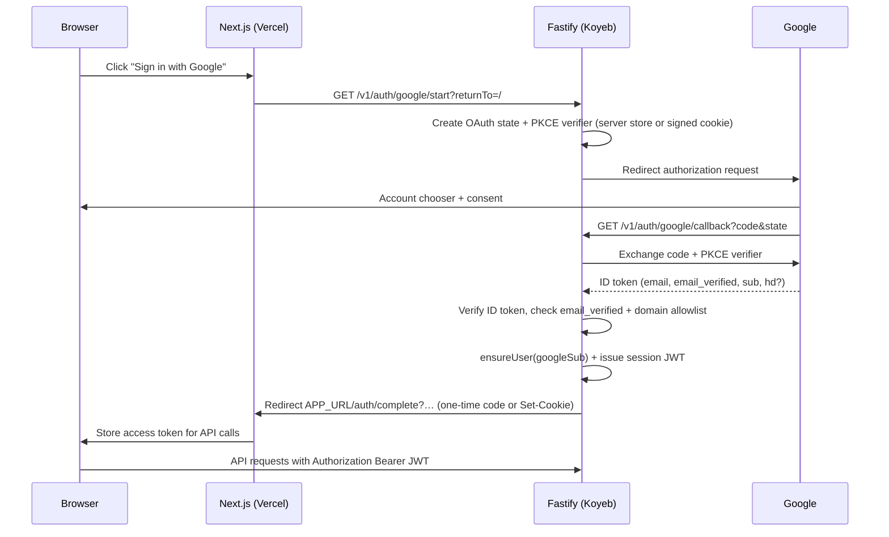

# Plan — Replace Clerk with Google SSO (Domain Allowlist)

Implementation: `[./IMPL_REPLACE_CLERK_AUTH.md](./IMPL_REPLACE_CLERK_AUTH.md)`
Historical context: `[../mvp/MVP_IMPLEMENTATION_PLAN.md](../mvp/MVP_IMPLEMENTATION_PLAN.md)` (Clerk chosen for MVP speed)
Branch target: `feature/google-sso-auth`
Last updated: 2026-06-06

---

## 1. Overview

Replace **Clerk** with **first-party authentication** backed by **Google OAuth 2.0 / OpenID Connect**. Sign-in is **Google SSO only** — no email/password, no magic links, no other IdPs in v1.

Access is gated by an **email-domain allowlist** configured server-side:

```env
AUTH_ALLOWED_EMAIL_DOMAINS=example.com,partner.org
```

Only Google accounts whose **verified primary email** ends with `@<allowed-domain>` may sign in or create an account. All other domains — including other `@gmail.com` users when the allowlist is organizational — are **rejected at the server** after Google returns tokens.

Teacher/student **roles**, class memberships, room authorization, and LiveKit identity remain **backend-owned** (unchanged from MVP). Auth only establishes **who** the user is; authorization stays in MongoDB.

### 1.1 Product goals


| #   | Goal                                                                                                                                                                                              |
| --- | ------------------------------------------------------------------------------------------------------------------------------------------------------------------------------------------------- |
| G1  | **Google-only SSO** — one “Sign in with Google” entry point; no separate sign-up page (first successful login creates the user).                                                                  |
| G2  | **Domain allowlist** — comma-separated env var; enforced on the API after Google token verification; clear error when domain is not allowed.                                                      |
| G3  | **Drop Clerk** — remove `@clerk/nextjs`, `@clerk/backend`, Clerk middleware, Clerk env vars, and Clerk dashboard dependency.                                                                      |
| G4  | **Preserve dev/E2E ergonomics** — local dev without Google credentials continues to use header-based dev identity; Playwright keeps `NEXT_PUBLIC_E2E_DEV_AUTH=true` bypass.                       |
| G5  | **Minimal client churn** — `ApiIdentity.getAuthToken()` and `Authorization: Bearer …` to the API stay the same shape; Lobby/RoomClient gates rename `clerkEnabled` → `authRequired` (or similar). |


### 1.2 Non-goals (v1)

- Microsoft, Apple, SAML, or additional OAuth providers.
- Self-service domain management UI (domains are ops-controlled via env only).
- Invite-only signup separate from domain policy (domain policy *is* the gate in v1).
- Automatic migration/linking of existing Clerk `user_`* IDs to Google `sub` (see §8 Migration).
- Step-up MFA beyond what Google provides.
- Admin impersonation or service accounts.

---

## 2. Current state (Clerk)


| Layer       | Today                                                                                                                                                                                                                |
| ----------- | -------------------------------------------------------------------------------------------------------------------------------------------------------------------------------------------------------------------- |
| Frontend    | `@clerk/nextjs`: `ClerkProvider`, `/sign-in`, `/sign-up`, `clerkMiddleware` in `[apps/web/proxy.ts](../../../apps/web/proxy.ts)`, `useAuth` / `useUser` in `[apps/web/lib/auth.tsx](../../../apps/web/lib/auth.tsx)` |
| API         | `[apps/api/src/auth.ts](../../../apps/api/src/auth.ts)`: `verifyToken` from `@clerk/backend`; `AuthContext.userId = claims.sub` (Clerk id, e.g. `user_2abc…`)                                                        |
| Persistence | `[ensureUser](../../../apps/api/src/models/mongoose.ts)`: upsert by `id = auth.userId`, `externalAuthId = auth.userId`                                                                                               |
| Dev         | Empty `NEXT_PUBLIC_CLERK_PUBLISHABLE_KEY` → dev headers (`x-dev-user-id`, …); production requires Clerk bearer token                                                                                                 |
| Env         | `CLERK_SECRET_KEY`, `NEXT_PUBLIC_CLERK_PUBLISHABLE_KEY`, optional `CLERK_WEBHOOK_SECRET` (unused in MVP)                                                                                                             |


Clerk user ids appear in MongoDB `users.id`, room audit fields (`createdByUserId`, etc.), and LiveKit participant metadata. Replacing auth must not corrupt historical rows without an explicit migration decision.

---

## 3. Target architecture

### 3.1 High-level flow




**Why OAuth callback on the API (Koyeb):** Google client secret stays on the backend only. The frontend never sees the secret. Split-domain deployment (Vercel app + Koyeb API) is handled via a **one-time exchange code** redirect back to the web app (§3.3).

### 3.2 Session model


| Artifact                          | Purpose                                                  | Lifetime                | Storage                                                                     |
| --------------------------------- | -------------------------------------------------------- | ----------------------- | --------------------------------------------------------------------------- |
| **Access JWT**                    | Sent as `Authorization: Bearer` on every API call        | 15–60 min (env tunable) | Client memory (`AppAuthContext`); optional `sessionStorage` for tab refresh |
| **Refresh token** (optional v1.1) | Rotate access JWT without re-login                       | 7–30 days               | httpOnly cookie on web origin **or** hashed row in MongoDB                  |
| **OAuth state**                   | CSRF protection for Google redirect                      | 10 min                  | Signed cookie or short-lived server cache                                   |
| **Exchange code**                 | Bridge API callback → web app without putting JWT in URL | 60 s, single use        | MongoDB or in-memory with TTL                                               |


v1 can ship **access JWT only** (user re-authenticates when expired) to reduce scope; document refresh as Phase 2 in IMPL.

**JWT claims (access):**

```ts
{
  sub: string;          // internal user id (see §4)
  email: string;        // verified Google email
  name: string;         // display name
  iat, exp, iss: "3dspace"
}
```

API `[authenticate()](../../../apps/api/src/auth.ts)` verifies signature with `AUTH_JWT_SECRET`, validates `iss`, checks `exp`, maps to `AuthContext`.

### 3.3 Split-domain handoff (Vercel ↔ Koyeb)

Production uses different hostnames for web and API. **Do not** pass long-lived JWTs in query strings.

Recommended handoff:

1. API callback creates a **single-use exchange code** bound to the new session.
2. API redirects to `{NEXT_PUBLIC_APP_URL}/auth/complete?code={exchangeCode}`.
3. Next.js route `apps/web/app/auth/complete/page.tsx` (client) calls `POST /v1/auth/session/exchange { code }` with credentials omitted; receives `{ accessToken, user: { id, displayName, email } }`.
4. Client stores token in auth context; strips `code` from URL via `replaceState`.

CORS: exchange endpoint allows the web origin; rate-limit by IP.

Alternative (same registrable domain only): Set `Set-Cookie` on `.example.com` from API — **not** applicable while app and API are on unrelated domains (`*.vercel.app` vs `*.koyeb.app`).

### 3.4 Dev / E2E mode (unchanged behavior)

When **either**:

- `NODE_ENV !== "production"` **and** Google OAuth env vars are unset, **or**
- `NEXT_PUBLIC_E2E_DEV_AUTH=true`

…then:

- Frontend skips Google UI; `authRequired = false` (same as today’s empty Clerk key).
- API accepts dev headers / `dev-`* bearer tokens per existing `[auth.ts](../../../apps/api/src/auth.ts)` dev branch.

Production **must** require configured Google OAuth + non-empty `AUTH_ALLOWED_EMAIL_DOMAINS` + `AUTH_JWT_SECRET`; `/ready` reports `auth: missing` otherwise.

---

## 4. Identity & user records

### 4.1 User id strategy

**New users:** stable internal id derived from Google subject:

```
id = "google:" + googleSub
externalAuthId = googleSub
```

Using a prefixed id avoids collisions with legacy Clerk `user_*` rows and dev `dev-*` ids.

**Display name:** Google `name`, falling back to email local-part (same precedence as today’s `displayNameFromClaims`).

### 4.2 User schema extensions

Extend MongoDB `users` / contracts `UserSchema`:


| Field            | Type                 | Notes                                              |
| ---------------- | -------------------- | -------------------------------------------------- |
| `email`          | string               | Verified Google email; indexed for support lookups |
| `authProvider`   | `"google"` | `"dev"` | Replaces implicit Clerk                            |
| `externalAuthId` | string               | Google `sub` (already exists; semantics change)    |
| `lastLoginAt`    | ISO string           | Updated each successful login                      |


No password hash field. Optional `pictureUrl` from Google profile (not required v1).

### 4.3 Account creation policy

- **First login** from an allowed domain → `ensureUser` upsert (same call sites as today in `[auth-guards.ts](../../../apps/api/src/http/auth-guards.ts)`).
- **Subsequent logins** → update `displayName`, `email`, `lastLoginAt` if Google profile changed.
- **Disallowed domain** → HTTP 403 with code `auth-domain-not-allowed`; **no** user row created.
- **Unverified Google email** (`email_verified !== true`) → HTTP 403 `auth-email-not-verified`.

There is **no** public registration endpoint beyond completing Google OAuth.

---

## 5. Domain allowlist policy

### 5.1 Configuration

```env
# Required in production. Comma-separated, case-insensitive, no @ prefix.
AUTH_ALLOWED_EMAIL_DOMAINS=school.edu,district.k12.ca.us
```

Parsing rules:

- Split on `,`, trim whitespace, lowercase.
- Reject empty entries at startup (`/ready` → `auth: invalid`).
- At least **one** domain required when Google OAuth is enabled in production.

Optional companion (documentation only in v1):

```env
# Passed to Google as `hd` hint — NOT a security control by itself.
AUTH_GOOGLE_HOSTED_DOMAIN_HINT=school.edu
```

Google’s `hd` parameter only **prefills** the Workspace account picker; users can still pick other Google accounts. **Always** enforce domain on the server using the verified email from the ID token.

### 5.2 Enforcement algorithm

After Google ID token verification:

```ts
function emailDomain(email: string): string {
  const at = email.lastIndexOf("@");
  if (at < 1) throw forbidden("auth-email-invalid");
  return email.slice(at + 1).toLowerCase();
}

function isDomainAllowed(email: string, allowed: string[]): boolean {
  const domain = emailDomain(email);
  return allowed.includes(domain);
}
```

**Exact match only in v1** — no subdomain wildcard (`*.school.edu`). If needed later, add `AUTH_ALLOW_SUBDOMAINS=true` and suffix matching in a follow-up.

### 5.3 User-facing errors


| Condition               | HTTP | Code                       | User message                                                                                    |
| ----------------------- | ---- | -------------------------- | ----------------------------------------------------------------------------------------------- |
| Domain not in allowlist | 403  | `auth-domain-not-allowed`  | “Sign-in is limited to approved organization accounts. Use your work or school Google account.” |
| Email not verified      | 403  | `auth-email-not-verified`  | “Your Google email must be verified before you can sign in.”                                    |
| OAuth state mismatch    | 400  | `auth-oauth-state-invalid` | “Sign-in expired. Try again.”                                                                   |
| Exchange code expired   | 401  | `auth-session-expired`     | “Session expired. Sign in again.”                                                               |


Sign-in page should render these when redirected with `?error=auth-domain-not-allowed`.

---

## 6. API surface

New routes under `/v1/auth` (OpenAPI + Zod in contracts):


| Method | Path                        | Auth   | Description                                                         |
| ------ | --------------------------- | ------ | ------------------------------------------------------------------- |
| GET    | `/v1/auth/google/start`     | Public | Redirect to Google; query `returnTo` (path only, validated)         |
| GET    | `/v1/auth/google/callback`  | Public | OAuth callback; redirect to web `/auth/complete`                    |
| POST   | `/v1/auth/session/exchange` | Public | `{ code }` → `{ accessToken, expiresAt, user }`                     |
| GET    | `/v1/auth/me`               | Bearer | Current user profile                                                |
| POST   | `/v1/auth/logout`           | Bearer | Invalidate refresh token if implemented; client clears access token |


Existing protected routes unchanged except `[authenticate()](../../../apps/api/src/auth.ts)` verifies first-party JWT instead of Clerk.

`/ready` auth check:

- Production: `GOOGLE_OAUTH_CLIENT_ID`, `GOOGLE_OAUTH_CLIENT_SECRET`, `AUTH_JWT_SECRET`, parsed allowlist all present → `ok`.
- Dev without OAuth → `degraded` (same as today’s missing Clerk key message).

---

## 7. Frontend UX

### 7.1 Sign-in

- **Remove** `/sign-up` route (Google first login creates account).
- **Replace** Clerk `<SignIn />` on `/sign-in` with a single primary button: **Sign in with Google** → navigates to `{API_URL}/v1/auth/google/start?returnTo=/`.
- Show domain hint when configured: “Use your `@school.edu` Google account.”
- Error banner from `?error=` query param after failed callback redirect.

### 7.2 Signed-in chrome

Replace Clerk `<UserButton />` in `[AuthGate](../../../apps/web/lib/auth.tsx)`:

- Show display name + avatar initial.
- **Sign out** → clear client token + optional `POST /v1/auth/logout` + redirect `/`.

Rename context flags:

- `clerkEnabled` → `authRequired` (true when Google OAuth configured).
- `getToken` → unchanged name for minimal diff in `[usePersistentIdentity](../../../apps/web/lib/usePersistentIdentity.ts)`.

### 7.3 Middleware

Replace `[clerkMiddleware](../../../apps/web/proxy.ts)` with either:

- **No auth middleware** (v1): pages stay public; Lobby/RoomClient gate actions when `authRequired && !signedIn` (current pattern), **or**
- Lightweight middleware that only protects `/rooms/`* by checking for session cookie/token.

Recommendation: **keep gating in components** (matches today) to avoid breaking marketing/lobby routes.

### 7.4 Lobby / RoomClient

Update copy: “Sign in with Clerk” → “Sign in with Google”. Behavior unchanged:

- `authDisabled = authRequired && !signedIn`
- Room join blocked until signed in when auth required.

---

## 8. Migration from Clerk

### 8.1 User id cutover

Existing production data uses Clerk ids (`user_`*) in `users.id` and foreign keys. Options:


| Strategy           | Pros                                | Cons                                                                                                           |
| ------------------ | ----------------------------------- | -------------------------------------------------------------------------------------------------------------- |
| **A. Clean break** | Simple; new Google ids              | Historical `createdByUserId` won’t match new logins; old users re-register as new rows                         |
| **B. Email link**  | One row per person if email matches | Requires one-time script: match Clerk email export → set `externalAuthId = googleSub`, optionally rewrite `id` |
| **C. Dual lookup** | Transitional                        | `authenticate` accepts Clerk JWT briefly while migrating                                                       |


**Recommendation for v1:** **Strategy A** if user count is small (MVP pilot). Document in release notes that users sign in again with Google; old Clerk accounts are orphaned read-only history. If production has meaningful Clerk users, run **Strategy B** before cutover.

### 8.2 Environment cutover checklist

1. Create Google Cloud OAuth client (Web application).
2. Authorized redirect URI: `{API_PUBLIC_URL}/v1/auth/google/callback`.
3. Set new env vars on Koyeb + Vercel; remove Clerk vars.
4. Deploy API first (accepts both JWT types briefly if dual-verify flag used — optional).
5. Deploy web (Google sign-in button).
6. Verify `/ready`, sign-in, room create/join, LiveKit session.
7. Decommission Clerk application after soak period.

### 8.3 Dependencies to remove

- `apps/web`: `@clerk/nextjs`
- `apps/api`: `@clerk/backend`
- Env: `CLERK_`*, `NEXT_PUBLIC_CLERK_*`

---

## 9. Security & threat model


| Threat                               | Mitigation                                                                  |
| ------------------------------------ | --------------------------------------------------------------------------- |
| Domain bypass via client tampering   | Domain check only on server using verified ID token email                   |
| CSRF on OAuth start/callback         | Random `state` + PKCE `code_verifier`                                       |
| Token theft (XSS)                    | Short-lived access JWT; prefer memory over `localStorage`; CSP as follow-up |
| Stolen exchange code                 | Single-use, 60s TTL, bound to redirect origin                               |
| Google token replay                  | Verify ID token signature, `aud`, `iss`, `exp` via Google JWKS or tokeninfo |
| Open redirect on `returnTo`          | Allowlist path-only URLs starting with `/`; reject `//` and `http`          |
| Brute force on exchange              | Rate limit `/v1/auth/session/exchange`                                      |
| Gmail users when org domain expected | Allowlist exact domains; communicate `@school.edu` requirement              |


Secrets:

- `GOOGLE_OAUTH_CLIENT_SECRET` — Koyeb only.
- `AUTH_JWT_SECRET` — Koyeb (+ Vercel server if Next route verifies JWT); ≥ 32 bytes random.

---

## 10. Environment variables


| Variable                         | Where                   | Required (prod) | Description                            |
| -------------------------------- | ----------------------- | --------------- | -------------------------------------- |
| `GOOGLE_OAUTH_CLIENT_ID`         | API                     | Yes             | Google OAuth client id                 |
| `GOOGLE_OAUTH_CLIENT_SECRET`     | API                     | Yes             | Google OAuth client secret             |
| `AUTH_JWT_SECRET`                | API (+ optional Vercel) | Yes             | HS256 secret for access JWT            |
| `AUTH_ALLOWED_EMAIL_DOMAINS`     | API                     | Yes             | Comma-separated allowed email domains  |
| `AUTH_JWT_TTL_SECONDS`           | API                     | No              | Access token lifetime (default `3600`) |
| `AUTH_GOOGLE_HOSTED_DOMAIN_HINT` | API                     | No              | Optional `hd` query hint for Google    |
| `AUTH_EXCHANGE_TTL_SECONDS`      | API                     | No              | One-time code TTL (default `60`)       |
| `NEXT_PUBLIC_E2E_DEV_AUTH`       | Web                     | No              | `true` disables auth for Playwright    |


**Remove:** `CLERK_SECRET_KEY`, `CLERK_WEBHOOK_SECRET`, `NEXT_PUBLIC_CLERK_PUBLISHABLE_KEY`.

Update: `.env.example`, `apps/api/.env.example`, `apps/web/.env.example`, `MVP_STATUS.md`, `DEPLOYMENT_CHECKLIST.md`, `README.md`.

---

## 11. Testing strategy


| Layer           | Coverage                                                                                      |
| --------------- | --------------------------------------------------------------------------------------------- |
| Unit            | Domain parser; JWT issue/verify; `returnTo` sanitizer; ID token claim extraction (mocked)     |
| API integration | Callback with mocked Google token exchange; domain allowed/blocked; exchange code flow        |
| E2E             | Keep `NEXT_PUBLIC_E2E_DEV_AUTH=true` path; optional mocked OAuth for one signed-in smoke test |
| Manual          | Real Google Workspace account on allowlisted domain; personal `@gmail.com` rejected           |


---

## 12. Rollout phases (summary)

See IMPL for file-level detail.


| Phase | Deliverable                                                     |
| ----- | --------------------------------------------------------------- |
| 0     | Contracts + config + `/ready` + domain parser tests             |
| 1     | API OAuth routes + JWT auth + `AuthContext` provider `"google"` |
| 2     | Web auth context + sign-in UI + `/auth/complete` exchange       |
| 3     | Remove Clerk deps; rename flags; update ops docs                |
| 4     | Production cutover + optional Clerk user migration script       |


---

## 13. Open questions

1. **Refresh tokens in v1?** YES
2. **Profile photos from Google?** Could populate avatar beyond initials/color — defer unless product wants it.
3. **Subdomain allowlist?** Start exact-match; revisit if districts use many subdomains.
4. **Clerk user migration?** Confirm production user count before choosing Strategy A vs B (§8.1). Use Strategy A.

