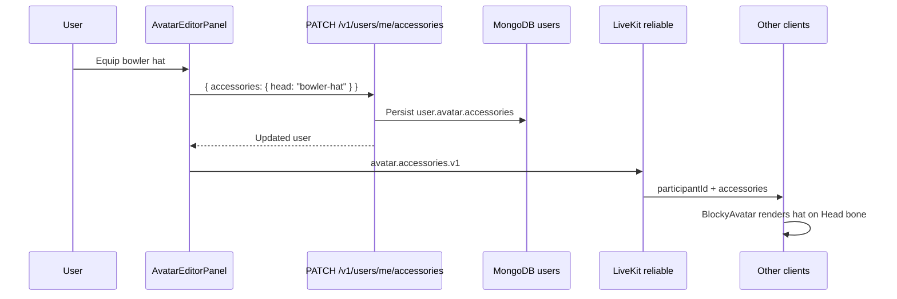

# Plan — Avatar Accessories (GLB attachments)

Implementation: [`./IMPL_AVATAR_ACCESSORIES.md`](./IMPL_AVATAR_ACCESSORIES.md)
Related: [`./06-data-and-networking.md`](./06-data-and-networking.md) (appearance persistence), [`../new-features/PLAN_ROOM_OBJECTS.md`](../new-features/PLAN_ROOM_OBJECTS.md) (GLB validation patterns)
Branch target: `feature/avatar-accessories`
Last updated: 2026-06-06

---

## 1. Overview

Add **avatar accessories** — optional GLB attachments that ride on the participant rig (hat, glasses, backpack, etc.) and are visible to everyone in the room. The first accessory is the **bowler hat** (`GLBs/bowler-hat.glb`, optimized to ~3.4 MB / ~3k tris).

Accessories are:

- **Catalog-driven** — each entry defines slot, asset URL, skeleton attach point, and local offset/rotation/scale.
- **User-owned** — equipped choices persist on the user record (like zone colors today).
- **Room-visible** — broadcast once on join and on change via a reliable LiveKit message (same pattern as `avatar.appearance.v1`).
- **Editor-managed** — a new **Accessories** section in the existing avatar editor panel.

### 1.1 Product goals

| # | Goal |
| --- | --- |
| G1 | Any participant can equip **zero or one accessory per slot** from a built-in catalog (v1: **head** slot only). |
| G2 | Equipped accessories render on the **Azure Vanguard** rig in 3D for all participants, including during walk/run/idle clips. |
| G3 | The **bowler hat** ships as the first catalog entry and is equippable from the avatar editor without instructions. |
| G4 | Accessory state **follows the user across sessions** (stored in MongoDB on `users.avatar`). |
| G5 | Teachers can **lock the avatar editor** during a lesson run (existing `avatarEditorLocked`) — accessories respect the same lock. |

### 1.2 Non-goals (v1)

- Custom user `.glb` uploads for accessories.
- Multiple accessories on the same slot (e.g. hat + crown).
- Slots beyond **head** (face, back, hand-held deferred).
- Accessory-specific animations (hat wobble, cape physics).
- 2D floor-map hat rendering (3D only in v1; 2D nameplate unchanged).
- Per-room or per-class accessory restrictions (global catalog for all room types).
- Marketplace, unlock progression, or paid cosmetics.
- Recoloring accessory materials from the zone color picker.

---

## 2. Current state

| Area | Today |
| --- | --- |
| Avatar mesh | `BlockyAvatar` → Azure Vanguard GLB (`/avatars/azure-vanguard.glb`), skinned mesh, 24-bone skeleton |
| Head bone | `Head` joint in skeleton (attach target for hats) |
| Appearance | `AvatarAppearanceSchema` — 23 hex zone colors; **not applied** to GLB (legacy/editor compat only) |
| Persistence | `PATCH /v1/users/me/avatar` with `{ appearance }`; stored on `user.avatar.appearance` |
| Realtime | `avatar.appearance.v1` — reliable, on join + on save |
| Editor | `AvatarEditorPanel` — zone color picker; opens from HUD + click-self |
| Lesson lock | `avatarEditorLocked` on classroom state; disables editor when lesson running |

The Azure Vanguard migration replaced the procedural blocky rig but kept the appearance schema and editor for forward compatibility. Accessories are the first **visual** customization that affects the live GLB avatar.

### 2.1 Pilot asset — bowler hat

| Property | Value |
| --- | --- |
| Source | `GLBs/bowler-hat.glb` (textures optimized: base color JPEG q85) |
| Size | ~3.4 MB, ~2,995 triangles |
| Bounds | ~0.04 m tall; mesh centered on origin |
| Structure | Single static mesh (`Mesh1.0`), no skeleton |
| Intended slot | `head` |

The hat is authored as a standalone prop. Catalog metadata supplies the offset from the `Head` bone so the brim sits correctly above the scalp across idle/walk/run.

---

## 3. Target architecture

### 3.1 Catalog + slots

```text
AvatarAccessoryCatalogEntry
  slug: "bowler-hat"
  displayName: "Bowler hat"
  slot: "head"
  glbUrl: "/avatar-accessories/bowler-hat.glb"
  attachBone: "Head"
  localPosition: { x, y, z }   // metres, in bone space
  localRotation: { x, y, z }   // radians (Euler)
  localScale: number           // uniform; multiplied by avatarScale
  nativeGroundY?: number       // if GLB origin is not the attach point
```

**Slots (v1):** `head` only.

**Equipped state (per user):**

```typescript
{
  head: "bowler-hat" | null   // slug or unequipped
}
```

Future slots (`face`, `back`, `hand`) extend the object without breaking v1 clients (unknown keys ignored).

### 3.2 Data flow



On room join, the local client:

1. Loads saved accessories from `GET /v1/users/me` (or session bootstrap).
2. Publishes `avatar.accessories.v1` to the room (reliable).
3. Applies remote messages into `useAvatarAccessories` map (parallel to `useAvatarAppearance`).

### 3.3 Rendering (3D)

Inside `BlockyAvatar`:

```text
group (position, rotationY, avatarScale)
  group (waveRef)
    AvatarModel (skinned GLB + animations)
    AvatarAccessoryLayer
      head → <AccessoryGlb url catalog.glbUrl attachBone Head offset… />
```

`AccessoryGlb`:

- Loads GLB via `useGLTF` + `Suspense`.
- Clones scene (materials per instance).
- Finds `attachBone` on the **cloned** skeleton (`SkeletonUtils.clone` instance).
- Parents accessory root to bone; applies catalog offset.
- Reuses `nativeGroundY` pattern from `GlbHostAvatar` when accessory origin is centered.

Accessories inherit avatar animation automatically because they are parented to bones.

### 3.4 API surface

| Method | Path | Purpose |
| --- | --- | --- |
| `GET` | `/v1/avatar-accessories` | List built-in catalog entries (slug, name, slot, thumbnail) |
| `PATCH` | `/v1/users/me/accessories` | Equip/unequip `{ accessories: AvatarEquippedAccessories }` |

`GET /v1/users/me` response adds `avatar.accessories` (nullable; `{}` or `{ head: null }` when unset).

**Validation rules:**

- Each equipped slug must exist in the built-in catalog.
- At most one slug per slot; `null` clears the slot.
- Unknown slots in the request body → 400.
- Unknown slug → 400.

### 3.5 Realtime message

```typescript
avatar.accessories.v1 {
  type: "avatar.accessories.v1",
  participantId: string,
  accessories: AvatarEquippedAccessories
}
```

Reliable delivery. Payload ~50 bytes for v1 (one head slug). Not bundled into `avatar.state.v1` (12 Hz).

---

## 4. Feature flag

| Env | Default | Scope |
| --- | --- | --- |
| `ENABLE_AVATAR_ACCESSORIES` | `false` | API catalog route + PATCH validation |
| `NEXT_PUBLIC_ENABLE_AVATAR_ACCESSORIES` | `false` | Web editor section + 3D render layer |

When off: API returns 404 on accessory routes; web hides editor section and skips `AvatarAccessoryLayer`. Existing users with stored accessories retain DB data but it is not shown until the flag is enabled.

---

## 5. Editor UX (v1)

Extend `AvatarEditorPanel` with an **Accessories** section below the color zones (or a tab if the panel grows).

| Control | Behavior |
| --- | --- |
| Head slot | Radio/list: **None** · **Bowler hat** (thumbnail from catalog) |
| Live preview | Draft accessories propagate to `BlockyAvatar` before save (mirror appearance draft) |
| Save | `PATCH /v1/users/me/accessories` + publish `avatar.accessories.v1` |
| Locked | When `avatarEditorLocked`, section disabled like color zones |

No separate HUD card — accessories live inside the existing avatar editor to avoid panel sprawl.

---

## 6. Asset pipeline

### 6.1 Built-in accessories

| Path | Purpose |
| --- | --- |
| `GLBs/bowler-hat.glb` | Authoring source (optimized) |
| `apps/web/public/avatar-accessories/bowler-hat.glb` | Served asset |
| `packages/avatar-accessories/catalog/builtin.json` | Catalog metadata (mirrors world-skins / room-objects) |
| `scripts/optimize-lp-glb.mjs` | Reuse for texture optimization (`node scripts/optimize-lp-glb.mjs GLBs/bowler-hat.glb`) |

### 6.2 Accessory authoring conventions

Future accessories should follow:

- **Static mesh** GLB (no skeleton required in the accessory file).
- **Known attach bone** documented in catalog.
- **Budget:** ≤ 8 MB file, ≤ 15k triangles, ≤ 4 embedded textures, max 2048 px (align with room-object gate where practical).
- **Origin:** Author with attach point at `(0,0,0)` *or* document `localPosition` + `nativeGroundY` in catalog.
- **Naming:** slug = kebab-case; file name matches slug.

### 6.3 Bowler hat attach tuning

Initial attach (to be refined in Phase 3 dev harness):

- `attachBone`: `"Head"`
- `localPosition`: `{ x: 0, y: 0.08, z: 0 }` (starting estimate — tune in `/dev/avatar-accessories`)
- `localRotation`: `{ x: 0, y: 0, z: 0 }`
- `localScale`: `1.0` (scaled again by `avatarScale` from world skin)

---

## 7. Persistence schema

Extend `UserSchema.avatar`:

```typescript
avatar: {
  color: string,
  initials: string,
  appearance?: AvatarAppearance | null,
  accessories?: AvatarEquippedAccessories | null   // new
}
```

MongoDB: nested object under existing `avatar` sub-document. No migration — absent field parses as `{ head: null }`.

---

## 8. Security & abuse

- **No user uploads in v1** — only API-seeded catalog slugs accepted.
- **GLB files are static public assets** — same trust model as avatar body GLB.
- **Rate limit:** accessory PATCH shares user profile update semantics (no extra limit v1).
- **Size validation at commit time** — CI/test asserts bowler-hat GLB within budget (optional `avatar-accessories-glb.test.ts`).

---

## 9. Testing strategy

| Layer | Coverage |
| --- | --- |
| Contracts | Schema parse, unknown slug rejection, legacy user without accessories |
| API | GET catalog, PATCH equip/unequip, invalid slug 400 |
| Web unit | `useAvatarAccessories` merge, catalog hook |
| Web render | Head bone attach smoke (dev harness or headless GLB load) |
| E2E | Equip hat → second client sees hat (behind flag in CI) |

---

## 10. Rollout

1. Ship behind flags default **off**.
2. Enable on staging; tune bowler-hat offset with teachers/internal users.
3. Enable in production after E2E passes.
4. Add README + memory index entry.

---

## 11. Future extensions (post-v1)

| Idea | Notes |
| --- | --- |
| More slots | `face` (glasses), `back` (cape), `hand` (prop) |
| Thumbnails | PNG previews in catalog for editor grid |
| Room-type gating | e.g. silly hats only in Free-for-All |
| Teacher "hat day" | Classroom action forcing a slot slug for event |
| Custom uploads | Reuse room-object GLB validator + R2 storage |
| 2D parity | Small hat glyph on floor-map token |

---

## 12. Open questions (resolve in IMPL)

| # | Question | Proposed default |
| --- | --- | --- |
| Q1 | Separate `avatar.accessories.v1` message vs extend `avatar.appearance.v1`? | **Separate message** — keeps appearance payload stable |
| Q2 | Single `PATCH /v1/users/me/accessories` vs extend existing avatar PATCH? | **Separate route** — avoids partial appearance validation on accessory-only saves |
| Q3 | Package name for catalog? | `packages/avatar-accessories/` (JSON + types) |
| Q4 | Hide hat in first-person? | **Yes** — accessories on local participant hidden when `firstPerson` (same as nameplate) |
