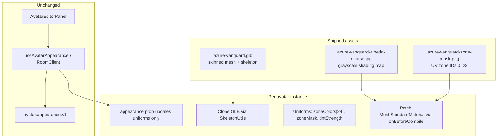
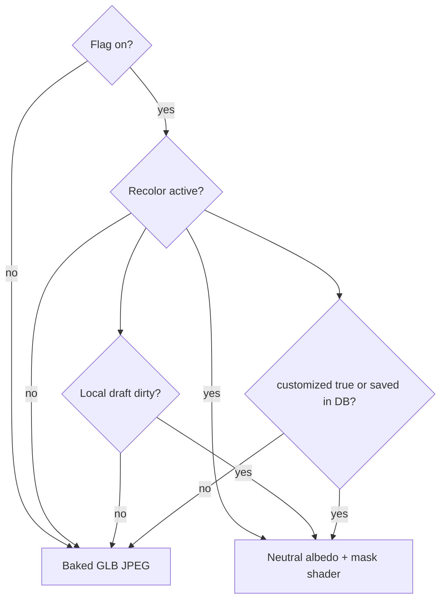

# Plan — GLB Avatar Recolor (UV mask + neutral albedo)

Implementation: [`./IMPL_AVATAR_GLB_RECOLOR.md`](./IMPL_AVATAR_GLB_RECOLOR.md)  
Related: [`./03-zone-system.md`](./03-zone-system.md) (23 zone keys), [`./PLAN_AVATAR_ACCESSORIES.md`](./PLAN_AVATAR_ACCESSORIES.md) (Azure Vanguard rig), [`./06-data-and-networking.md`](./06-data-and-networking.md) (appearance persistence — unchanged)  
Branch target: `feature/avatar-glb-recolor`  
Last updated: 2026-06-07

---

## 1. Overview

Wire the existing **23-zone avatar color editor** to the live **Azure Vanguard GLB** avatar using the strongest practical recolor stack:

1. **Neutral (grayscale) base-color albedo** — shading and detail without baked hue fighting the picker.
2. **UV zone mask texture** — per-texel zone IDs aligned to the avatar UV atlas.
3. **Luminance-preserving recolor shader** — replaces chroma per zone so a blue shirt can become a truly saturated red.

No changes to `AvatarAppearanceSchema`, API routes, MongoDB shape, or editor UX. One optional field (`customized`) on the `avatar.appearance.v1` message envelope. The **3D render path** in `BlockyAvatar` starts consuming `appearance` when customization is active.

### 1.1 Product goals

| # | Goal |
| --- | --- |
| G1 | Every zone in **Your Avatar** visibly updates the GLB in the 3D scene (live preview + saved state). |
| G2 | Recolor is **hue-faithful** — picking red on a blue shirt yields red, not muddy brown multiply. |
| G3 | Folds, wrinkles, and lighting detail from the baked texture are **preserved** after recolor. |
| G4 | Remote participants see updated colors within the existing `avatar.appearance.v1` latency (~100 ms local). |
| G5 | Accessory attachments (hats, etc.) render **unchanged** on top of the recolored body. |
| G6 | Users who have **never saved** avatar colors see the **original baked GLB** — identical to today. Recolor applies only after the first successful `PATCH /v1/users/me/avatar` save (or while the editor preview is open with unsaved draft changes). |

### 1.2 Non-goals (v1)

- Recoloring **accessory GLBs** from the zone picker (explicitly deferred in accessories plan).
- User-uploaded skins or texture painting.
- Per-pixel freehand editing beyond the 23 named zones.
- 2D floor-map avatar recolor (3D only; 2D nameplate unchanged).
- Runtime mask generation without a shipped mask asset (heuristic bone/UV auto-mask is a fallback only, not the target).
- New appearance fields or schema version bump.
- Mobile GPU fallbacks below WebGL2 / shader patch support.

---

## 2. Problem statement

| Layer | Today |
| --- | --- |
| Editor | 23 zone color pickers in `AvatarEditorPanel` — works |
| Persistence | `PATCH /v1/users/me/avatar` + MongoDB `user.avatar.appearance` — works |
| Realtime | `avatar.appearance.v1` reliable broadcast — works |
| Live preview | `effectiveGetAppearance` passes draft to `BlockyAvatar` — works |
| **3D render** | `appearance` prop is **ignored** (`_appearance`); GLB shows baked JPEG only |

The Azure Vanguard GLB has **one skinned mesh**, **one material**, and a **full-color baked base-color JPEG**. Simple `material.color` multiply cannot turn blue regions into clean red because the old chroma remains in the texture.

---

## 3. Target architecture



### 3.1 Recolor equation (per fragment)

After sampling the neutral albedo `base` and zone mask `mask`:

```glsl
int zone = int(texture2D(zoneMask, vUv).r * 255.0 + 0.5);
vec3 tint = zoneColors[zone];          // from AvatarAppearance, as linear RGB
float luma = dot(base.rgb, vec3(0.299, 0.587, 0.114));
vec3 recolored = tint * luma;          // replace chroma, keep shading
// zone == 0: passthrough (eyes, lips, hardware — use neutral base as-is)
diffuseColor.rgb = zone > 0 ? recolored : base.rgb;
```

**Why this beats multiply:** hue from the picker fully replaces the baked hue; only brightness structure survives.

**Why neutral albedo:** even with luminance math, strong baked saturation can leave color cast in mid-tones. A grayscale albedo removes that fight entirely.

### 3.2 Zone mask encoding

| Mask value (R channel ÷ 255) | Meaning |
| --- | --- |
| `0` | **Passthrough** — no tint; show neutral albedo (eyes, teeth, small hardware) |
| `1`–`23` | Tint with `zoneColors[zoneId]` per table below |

Mask texture requirements:

- Same UV layout as the avatar albedo (texels align 1:1 with `TEXCOORD_0`).
- `NearestFilter` on mask sampler — sharp zone boundaries, no bleeding between IDs.
- PNG, 8-bit RGB; only **R** is read (G/B reserved for tooling/debug overlays).
- Authored at the **same resolution** as the neutral albedo (see asset pipeline).

### 3.3 Zone ID registry

Stable mapping from `AvatarAppearance` keys → mask ID → editor label. IDs are **fixed forever** once shipped; reordering breaks saved appearances visually.

| ID | `AvatarAppearance` key | Editor label (from `ZONE_LABELS`) |
| ---: | --- | --- |
| 1 | `hairTop` | Hair top |
| 2 | `hairFront` | Hair front |
| 3 | `headSide` | Head sides |
| 4 | `hairBack` | Hair back |
| 5 | `faceSkin` | Face skin |
| 6 | `faceAccent` | Face accent |
| 7 | `collar` | Collar |
| 8 | `shirtFront` | Shirt front |
| 9 | `shirtBelly` | Shirt belly |
| 10 | `shirtBack` | Shirt back |
| 11 | `shirtSide` | Shirt sides |
| 12 | `shoulderTop` | Shoulder top |
| 13 | `shoulderCap` | Shoulder cap |
| 14 | `sleeve` | Sleeves |
| 15 | `hand` | Hands |
| 16 | `thigh` | Thighs |
| 17 | `shin` | Shins |
| 18 | `legSide` | Leg sides |
| 19 | `legBack` | Leg back |
| 20 | `shoeTop` | Shoe top |
| 21 | `shoeToe` | Shoe toe |
| 22 | `shoeSide` | Shoe sides |
| 23 | `shoeSole` | Shoe sole |

Source of truth for this table: `apps/web/lib/avatarZoneRegistry.ts` (created in implementation).

### 3.4 Shader integration strategy

**Use `MeshStandardMaterial.onBeforeCompile`** — not a from-scratch `ShaderMaterial`.

| Requirement | Why |
| --- | --- |
| Keeps Three.js skinning | `SkinnedMesh` + standard vertex shader skinning attrs |
| Keeps PBR lighting | Room lighting, shadows, roughness from GLB unchanged |
| Per-instance clones | Each participant clones materials (already done for accessories pattern) |

Patch point: inject recolor logic **after** `map_fragment` / diffuse sample, **before** outgoing `diffuseColor` feeds lighting.

### 3.5 Asset variants

| Asset | Path | Role |
| --- | --- | --- |
| Rig + clips | `/avatars/azure-vanguard.glb` | Existing; swap albedo reference to neutral in GLB **or** override `material.map` at runtime |
| Neutral albedo | `/avatars/azure-vanguard-albedo-neutral.jpg` | Grayscale shading |
| Zone mask | `/avatars/azure-vanguard-zone-mask.png` | Per-texel zone IDs |
| Source art | `GLBs/azure-vanguard/` (new folder) | Authoring sources, mask PSD, provenance |

**Runtime override (preferred):** keep the shipped GLB path stable; on clone, replace `material.map` with the neutral texture and bind the mask as `material.userData.zoneMask` or a named uniform. Avoid re-exporting animation clips.

---

## 4. Asset pipeline

### 4.1 Generate neutral albedo (automated)

Script: `scripts/generate-avatar-recolor-assets.mjs`

1. Extract baked base-color JPEG from `azure-vanguard.glb` (or read source from `GLBs/`).
2. Desaturate with **luminance preservation** (not naive `grayscale()` — use Rec. 709 weights).
3. Optionally apply mild contrast curve so folds remain visible after tinting.
4. Write `apps/web/public/avatars/azure-vanguard-albedo-neutral.jpg`.

```bash
node scripts/generate-avatar-recolor-assets.mjs --albedo-only
```

### 4.2 Author zone mask (semi-automated + manual QA)

The mask is the **one asset that needs human judgment**. Workflow:

1. **UV reference render** — script dumps UV layout PNG (`azure-vanguard-uv-reference.png`) for painting.
2. **Initial fill** — optional clustering script proposes island fills from neutral albedo + Y/bone hints (bootstrap only).
3. **Manual paint** — Blender UV editor or Photoshop/Krita on the reference:
   - Fill shirt UV islands with gray `8/255` (zone ID 8 = `shirtFront`), etc.
   - Leave eyes/mouth at `0`.
   - Use hard edges; no anti-aliased IDs (nearest sampling).
4. **Validation** — `scripts/validate-avatar-zone-mask.mjs`:
   - Every ID 1–23 appears at least once.
   - No unknown IDs > 23.
   - Coverage report (% texels per zone).
5. Commit `azure-vanguard-zone-mask.png` + `SOURCES.md` entry.

### 4.3 Dev harness for mask iteration

Page: `/dev/avatar-recolor`

- Renders Azure Vanguard with live zone color pickers.
- Toggle: show mask overlay / UV reference / neutral vs original albedo.
- Export appearance JSON for regression fixtures.
- Used to tune mask boundaries before shipping.

---

## 5. Client integration (summary)

| Component | Change |
| --- | --- |
| `BlockyAvatar.tsx` | Pass `appearance` into `AvatarModel`; remove `_appearance` ignore |
| `avatarRecolorShader.ts` (new) | `applyAvatarRecolorPatch(material, textures, appearance)` |
| `avatarZoneRegistry.ts` (new) | ID ↔ key ↔ label; build `zoneColors` uniform array |
| `avatarMaterials.ts` | Unchanged for editor labels; optional: export zone order from registry |
| `useAvatarAppearance` / API / editor | **No changes** |

### 5.1 Performance

| Concern | Mitigation |
| --- | --- |
| Extra texture sample (mask) | One `texture2D` per fragment — negligible on desktop/mobile targets |
| Material clone per participant | Already required for independent accessories; same pattern |
| Appearance updates | Uniform-only updates; no geometry/texture rebuild |
| Texture memory | Neutral + mask shared via `TextureLoader` cache (~2–4 MB total) |

### 5.2 Feature flag (rollout)

| Env | Default | Purpose |
| --- | --- | --- |
| `NEXT_PUBLIC_ENABLE_AVATAR_GLB_RECOLOR` | `false` | Staged rollout; when off, current baked JPEG look |

When flag is off, behavior matches today (ignore appearance). When on, recolor applies **only when customization is active** (see §5.3).

### 5.3 Passthrough until first save (preserve default look)

Recolor must **not** alter the Azure Vanguard baked JPEG for users who have never customized. The neutral albedo + mask shader runs only when customization is confirmed.

#### When recolor is **off** (original baked GLB)

| Condition | Who |
| --- | --- |
| `session.avatarAppearance === null` (never saved to MongoDB) | Local participant |
| `appearanceCustomized === false` on received `avatar.appearance.v1` | Remote participant |
| Editor closed and no saved appearance | Local participant |

Render path: keep GLB default `material.map` (full-color baked JPEG). No shader patch. No neutral albedo swap.

#### When recolor is **on**

| Condition | Who |
| --- | --- |
| User completed at least one `PATCH /v1/users/me/avatar` (`avatar.appearance` non-null in DB) | Local + remote after broadcast |
| Editor open with **dirty draft** (live preview — zone changed since panel opened) | Local only |
| `appearanceCustomized === true` on `avatar.appearance.v1` | Remote participant |

Render path: neutral albedo + zone mask + luminance shader with current `appearance` uniforms.

#### Editor live preview

While the avatar editor is open and the draft differs from the last saved appearance (`dirty === true`), the **local** avatar uses the recolor shader so picks are immediately visible — even before Save. Closing the editor without saving reverts to baked passthrough (if never saved) or last saved recolor (if previously saved).

#### Remote participant signaling

Add optional `customized: boolean` to `AvatarAppearanceMessageSchema` (envelope only — `AvatarAppearance` object unchanged):

```typescript
export const AvatarAppearanceMessageSchema = z.object({
  type:          z.literal("avatar.appearance.v1"),
  participantId: z.string(),
  appearance:    AvatarAppearanceSchema,
  customized:    z.boolean().optional(), // true after first PATCH save
});
```

Publish rules:

- On room join / new-peer re-broadcast: `customized: session.avatarAppearance != null`
- On editor save: `customized: true`
- Clients omitting `customized` (older builds): treat as `!appearanceEqualsDefault(appearance)` for backward compatibility — non-default appearance still recolors; exact-default messages passthrough

#### `appearanceEqualsDefault` helper

Shared util compares all 23 keys to `DEFAULT_APPEARANCE` (case-normalized hex). Used for legacy message fallback only — **not** as the primary gate (users may intentionally save the default palette).



---

## 6. Quality bar & acceptance criteria

### 6.1 Visual acceptance (manual sign-off)

- [ ] **Never-saved user** (flag on): avatar is **pixel-identical** to pre-feature baked GLB — no neutral albedo, no default-zone tint.
- [ ] **Never-saved user** opens editor, changes shirt, does not save: live preview shows red shirt; on close without save, reverts to baked GLB.
- [ ] **First save** (`PATCH` 200): avatar switches to recolor pipeline and persists after reload.
- [ ] **Remote peer** sees never-saved user with baked GLB; sees saved user with recolor.
- [ ] Change `shirtFront` from navy default to `#ff0000` — chest reads **clearly red** under room lighting, not purple/brown.
- [ ] Change `hairTop` — hair changes independently of `faceSkin`.
- [ ] Change `shoeToe` vs `shoeSole` — distinct zones visible on shoe.
- [ ] Eyes/teeth (mask `0`) — remain natural; not tinted by nearby zone picks.
- [ ] Walk/run/idle clips — no recolor popping; mask stable while deforming.
- [ ] Two participants side by side — different appearances, no shared-material bleed.
- [ ] Bowler hat (accessories on) — hat material unchanged when body zones change.

### 6.2 Automated checks

- Unit: `appearanceToZoneColors()` maps all 23 keys → 24-element uniform array at correct indices.
- Unit: shader patch attaches once per material clone; second call is idempotent.
- Playwright: open editor, change shirt color, assert canvas pixel sampling or screenshot diff threshold (see implementation doc).

---

## 7. Risks & mitigations

| Risk | Mitigation |
| --- | --- |
| Mask misalignment at UV seams | Nearest filter; validate with harness overlay; fix in mask art |
| Zone boundaries visible on mesh | Soften only via **mesh topology**, not mask blur; adjust paint in problem areas |
| Shader patch breaks on Three.js upgrade | Pin patch behind single module; add snapshot test of injected GLSL strings |
| Heavily saturated defaults look wrong on neutral albedo | Passthrough until first save avoids applying defaults; tune `tintStrength` in harness for saved palettes |
| Never-saved users look different after flag on | Passthrough gate (§5.3); acceptance test in §6.1 |
| Remote peers can't tell saved vs default broadcast | `customized` on `avatar.appearance.v1`; legacy fallback via `appearanceEqualsDefault` |
| Hair suppression (hats) hides scalp zones | Accessory hair suppression already scales bones; mask still correct on visible skin |

---

## 8. Resolved decisions

| Question | Decision |
| --- | --- |
| Color fidelity approach | Neutral albedo + UV mask + luminance tint shader |
| Schema / API changes | None |
| Shader technique | `onBeforeCompile` patch on `MeshStandardMaterial` |
| Mask authoring | Semi-automated bootstrap + manual paint + validation script |
| Zone ID stability | Fixed 1–23 registry in `avatarZoneRegistry.ts` |
| Albedo delivery | Runtime `material.map` override + shared neutral JPEG |
| Rollout | `NEXT_PUBLIC_ENABLE_AVATAR_GLB_RECOLOR` flag, default off |
| Default look preservation | **Passthrough until first save** — baked GLB when `avatar.appearance` is null; editor dirty draft enables local preview only |
| Realtime envelope | Optional `customized: boolean` on `avatar.appearance.v1` (not on `AvatarAppearance` schema) |

---

## 9. Future extensions (out of v1 scope)

- **Accessory recolor** — separate mask per accessory GLB or shared slot tint uniform.
- **Additional avatar bodies** — registry + mask per GLB slug; appearance schema unchanged.
- **Teacher “palette lock”** — restrict zone keys server-side (classroom policy).
- **2D avatar chips** — derive 2D swatch from zone colors for floor map.
