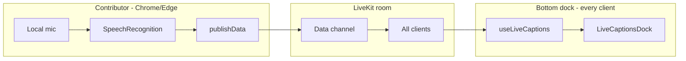

# Plan — Live Captions (Free-for-All Room Type)

Source room type: [`PLAN_FREE_FOR_ALL_ROOM.md`](./PLAN_FREE_FOR_ALL_ROOM.md)
Implementation parent: [`IMPL_FREE_FOR_ALL_ROOM.md`](./IMPL_FREE_FOR_ALL_ROOM.md)
Related: [`PLAN_FREE_FOR_ALL_AI_MEETING_NOTES.md`](./PLAN_FREE_FOR_ALL_AI_MEETING_NOTES.md) (paid server transcription — separate feature)
Parity source: [`FRAME_FEATURE_PARITY_GAP_ANALYSIS.md`](./FRAME_FEATURE_PARITY_GAP_ANALYSIS.md) (Closed captions)
Branch target: `room-types` (additive feature)
Last updated: 2026-05-30

---

## 1. Overview

Add **free live captions** to Free-for-All rooms using the browser **`SpeechRecognition` API** (Chrome / Edge). Each participant who opts in transcribes **their own microphone** locally and broadcasts text to the room over the **existing LiveKit data channel**. All participants see captions in a **bottom dock** spanning the viewport — not in the right-side HUD rail.

**Cost model:** $0 API spend. Audio for transcription is handled by the browser vendor (Google on Chrome) when a participant opts in; 3DSpace does not upload audio or call OpenAI.

**Scope:** Free-for-All only in v1. Distinct from **AI Meeting Notes** (paid OpenAI pipeline, session persistence, summary downloads).

### 1.1 Product goals

1. Any FFA participant can **view** the shared caption stream when the feature is enabled.
2. Any participant on **Chrome or Edge** can **opt in** to share captions from their mic (`Share my captions`).
3. Captions render in a **bottom dock** visible in both 3D and 2D views — readable, non-intrusive, and usable on narrow viewports (where the right HUD is hidden).
4. Multi-speaker attribution: each line shows **who spoke** and **when** (relative elapsed time).
5. Captioning stops automatically when the contributor mutes, leaves, or toggles off.
6. No server persistence in v1 — transcript lives in client memory + data channel only.

### 1.2 Non-goals (Phase 1)

- Server-side STT (Deepgram, Azure, OpenAI, LiveKit egress).
- Right-side HUD panel or wall-board caption surface.
- Translation, VTT/SRT export, session history, or AI summary.
- Classroom / workforce-training room types.
- Captioning remote participants’ audio (each speaker captions only their own mic).
- Safari / Firefox as caption **contributors** (viewers still see the dock).

---

## 2. UX — bottom caption dock

Captions follow the familiar **video-call / broadcast subtitle** pattern: a horizontal strip along the bottom of the room stage, not buried in a collapsible sidebar.

### 2.1 Layout placement

New element: **`LiveCaptionsDock`** — sibling to `room-hud-top`, `room-hud-left`, and `room-hud-right` inside `.room-shell`.

```
┌─────────────────────────────────────────────────────────────┐
│  room-hud-top (exit, room name, 3D/2D, REC/CC badges)       │
├──────────┬──────────────────────────────────────┬───────────┤
│ room-    │                                      │ room-     │
│ hud-left │         3D / 2D stage                │ hud-right │
│ (media,  │                                      │ (boards,  │
│  dpad)   │                                      │  etc.)    │
│          │                                      │           │
├──────────┴──────────────────────────────────────┴───────────┤
│  room-captions-dock  ← full-width bottom strip (this plan)   │
└─────────────────────────────────────────────────────────────┘
```

**CSS anchor (desktop):**

| Property | Value | Rationale |
|---|---|---|
| `position` | `absolute` | Overlay on `.room-stage`, same pattern as other HUD layers |
| `bottom` | `6px` | Matches HUD inset |
| `left` | `calc(var(--hud-lw) + 18px)` | Clears left identity / dpad column |
| `right` | `calc(var(--hud-pw) + 18px)` | Clears right HUD rail when visible |
| `z-index` | `21` | Above stage (`z-index: 20` HUD); below modals |
| `max-height` | `32vh` expanded / `4.5rem` collapsed | Keeps room playable |
| `pointer-events` | `auto` on dock only | Stage clicks pass through margins |

**Narrow / mobile (`max-width: 640px`):** right HUD hidden — set `right: 6px`. Dock spans nearly full width; left inset still clears the compact left stack.

**Stage safe area:** optional `--captions-dock-height` CSS variable updated when dock expands/collapses so `RoomView3D` floor UI (if any) can pad — not required in v1.

### 2.2 Dock states

| State | What everyone sees | Controls |
|---|---|---|
| **Idle** | Dock hidden or minimal pill: `CC · Off` | Tap/click opens dock chrome |
| **Listening (viewer)** | Dock visible; “Waiting for speech…” when no contributors | — |
| **Live** | Scrolling caption lines; contributor chips in header | **Share my captions** toggle (local) |
| **Unsupported browser** | Dock visible; contributor toggle disabled with tooltip | “Chrome or Edge required to share captions” |
| **Mic off (contributor)** | Your share toggle auto-off; status “Mic off — captions paused” | Re-enable mic to resume |

Dock is **visible by default** once any participant shares captions, or when the local user opens it. Collapse to a **single-line peek** (latest utterance only) via chevron — not fully hidden while live, so accessibility users don’t lose context.

### 2.3 Caption line presentation

Each finalized chunk renders as one row:

```
[ 02:14 ]  Alice                    The quick brown fox jumps…
           ^speaker (semibold)      ^text (regular, wraps 1–2 lines in collapsed mode)
```

**Collapsed dock (default while live):**

- Shows **at most 2 lines** of transcript (newest at bottom).
- Auto-scrolls to latest final line; smooth scroll, respects `prefers-reduced-motion`.
- Speaker name as a short pill when the speaker changes (hide repeat name if same speaker within 8 s).

**Expanded dock:**

- Taller scroll region (up to `32vh`).
- Same segment list; user can scroll up to re-read (~80–120 lines retained client-side).
- **Copy visible transcript** button in dock header (clipboard, client-only).

**Interim (partial) text:**

- Show as the **last line** in muted/italic style while the speaker is still talking.
- Replace with final text when `isFinal` arrives — do not accumulate duplicate lines.

Visual treatment matches existing HUD tokens (`--hud-bg`, `--hud-bd`, `--hud-tx`, backdrop blur) — same family as `.room-hud-top`, not a separate white card.

### 2.4 Dock header (compact chrome)

Single horizontal row (~32–36 px):

| Element | Purpose |
|---|---|
| **CC** badge | Indicates captions feature; pulses subtly when live |
| **Contributor chips** | `Captioning: Alice, Bob` (max 3 names + “+N”) |
| **Share my captions** | Toggle; `hud-btn` style; active = `hud-btn--active` |
| **Expand / collapse** | Chevron toggles 2-line vs scroll tray |
| **Copy** | Visible only when expanded and buffer non-empty |

No Start/Stop session, no downloads, no summary tab — keeps distinction from AI Meeting Notes clear.

### 2.5 Top-bar coordination

When **any** participant is sharing captions, show a **`CC` pill** in `room-hud-top` (distinct from the red **`REC`** meeting-notes badge):

- `CC` — amber/neutral; captions active, no server recording implied.
- `REC` — existing meeting-notes only.

Both may appear simultaneously if both features are enabled; copy must clarify the difference in lobby consent.

### 2.6 Consent & privacy copy

**Lobby (FFA join)** — one line when feature flag on:

> Participants may optionally share live captions using their browser (Chrome or Edge). Caption text is sent to others in the room over realtime channels; audio may be processed by your browser vendor. No transcript is stored on 3DSpace servers.

**Dock contributor toggle** — inline before first enable:

> Your speech will appear at the bottom of the screen for everyone in the room.

**Avatar affordance (optional v1.1):** small `CC` dot on nameplates of active contributors — same consent visibility pattern as meeting-notes mic dots.

### 2.7 2D analog parity

The same **`LiveCaptionsDock`** mounts once at `.room-shell` level — **not** duplicated inside `RoomView2D`. Both 3D and 2D views share one dock; switching view mode does not reset caption state.

---

## 3. Architecture

### 3.1 Data flow



- **No REST routes** in v1.
- **No API persistence** — late joiners see captions only from after they joined.
- **BroadcastChannel dev fallback** works automatically via existing `createRealtimeClient().publish()`.

### 3.2 Realtime messages

Add to `packages/contracts` and `apps/web/lib/realtime.ts`:

```typescript
// Reliable — finalized utterance (append or replace interim for chunkId)
room.captions.chunk.v1 {
  roomId: string
  participantId: string
  chunkId: string
  text: string
  isFinal: true
  startMs: number        // ms since that speaker enabled sharing
  sentAt: number
}

// Unreliable — partial hypothesis (add type to isRealtimeUnreliable)
room.captions.interim.v1 {
  roomId: string
  participantId: string
  chunkId: string
  text: string
  sentAt: number
}

// Reliable — contributor stopped (optional; also infer from leave/mute)
room.captions.contributor.v1 {
  roomId: string
  participantId: string
  active: boolean
  sentAt: number
}
```

**Throttling:** interim publishes capped at ~6 Hz per speaker. Finals sent immediately.

**Buffer:** each client keeps last **100** final lines; trim oldest. Interim map keyed by `participantId:chunkId`.

**Speaker names:** messages carry only `participantId` (not `displayName`) to keep payloads small and prevent spoofed labels. Receivers resolve names from the existing `participants` map in `RoomClient` (same approach as `useMeetingNotes.speakerLabel`), falling back to the raw `participantId` if presence has not arrived yet.

**Union type:** add `LiveCaptionsRealtimeMessage` (union of the three schemas above) to `apps/web/lib/realtime.ts` and include it in the `RealtimeMessage` union — mirroring how `MeetingNotesRealtimeMessage` is composed at lines 61–66.

### 3.3 Client modules

| File | Role |
|---|---|
| `apps/web/lib/useSpeechRecognition.ts` | Thin wrapper: support check, start/stop, `onInterim` / `onFinal`, error recovery |
| `apps/web/lib/useLiveCaptions.ts` | Contributor lifecycle, publish, receive, buffer, contributor set |
| `apps/web/components/LiveCaptionsDock.tsx` | Bottom dock UI |
| `apps/web/components/RoomClient.tsx` | Mount dock, wire handler ref, pass mic state |
| `apps/web/app/globals.css` | `.room-captions-dock`, `.room-captions-dock__*` |
| `packages/contracts/src/index.ts` | Schemas + `liveCaptions` on `RoomTypeFeatureFlags` |

Pattern mirrors **`useAvatarReactions`** (receive state) + **`avatar.reaction.v1`** publish — not **`useMeetingNotes`** (no API).

### 3.4 Contributor rules

1. Toggle **Share my captions** → require mic on + `SpeechRecognition` available.
2. Start recognition: `continuous: true`, `interimResults: true`, `lang: "en-US"` (v1 fixed).
3. Pause/stop when: toggle off, mic muted, `participant.leave`, recognition `onend` without intent (restart once with backoff), tab hidden (optional pause).
4. Broadcast `room.captions.contributor.v1 { active: true/false }` on start/stop so dock header chips stay accurate.

### 3.5 Feature flags

| Flag | Default | Scope |
|---|---|---|
| `NEXT_PUBLIC_ENABLE_LIVE_CAPTIONS` | `false` (`=== "true"` opt-in) | Web (`CLIENT_TUNING.enableLiveCaptions`) |
| `RoomTypeFeatureFlags.liveCaptions` | `true` for `free-for-all` only | Contracts |

**No API env flag in v1.** Captions never touch `apps/api` (no routes, no `AppConfig` change). The name `ENABLE_LIVE_CAPTIONS` is **reserved** for a future optional server relay (v2) but is not added now. Default the web flag OFF (`=== "true"`), unlike `enableWhiteboards`/`enableAvatarReactions` which default on with `!== "false"`.

Gate in `RoomClient`:

```typescript
const liveCaptionsEnabled =
  roomTypeFeatures.liveCaptions &&
  CLIENT_TUNING.enableLiveCaptions &&
  Boolean(session);
```

**Do not** reuse `aiMeetingNotes` / `ENABLE_AI_MEETING_NOTES` — separate product surfaces and cost models.

---

## 4. Browser support

| Browser | Share captions | View dock |
|---|---|---|
| Chrome / Edge | Yes | Yes |
| Safari (macOS / iOS) | No | Yes |
| Firefox | No | Yes |

Product positioning: **Chrome-first accessibility aid**, not platform parity with Zoom server captions.

---

## 5. Risks & mitigations

| Risk | Mitigation |
|---|---|
| Safari/iPad cannot contribute | View-only dock + clear toggle disabled state |
| Bottom dock obscures floor / dpad | Inset left/right; collapsed default; max-height cap |
| Interim floods data channel | Throttle + unreliable channel for interim |
| Confusion with AI Meeting Notes | Separate flags, `CC` vs `REC` badges, no shared panel |
| Google processes contributor audio | Accurate lobby/dock consent copy |
| No history for late joiners | Document limitation; optional v2 server relay |
| Double mic capture (LiveKit + SR) | Test on Chromebook; generally OK on Chrome |

---

## 6. Implementation phases

### Phase 1 — Core loop (~2–3 days)

- Contract messages + `useSpeechRecognition` + `useLiveCaptions`
- `LiveCaptionsDock` (collapsed 2-line mode + expand)
- `RoomClient` wiring + FFA feature flag + env templates
- Basic CSS dock positioning with left/right HUD insets

### Phase 2 — Polish (~1 day)

- Top-bar `CC` pill, contributor chips, copy-to-clipboard
- Mic-off auto-stop, unsupported-browser messaging
- Lobby consent line
- `prefers-reduced-motion` scroll behavior

### Phase 3 — Optional follow-ups

- Avatar `CC` dot on active contributors
- Manual “type a caption” fallback for non-Chrome users (still $0)
- Dock height CSS variable for stage padding if playtesting shows overlap issues

**Out of scope:** wall-object captions, translation, persistence, VTT export.

---

## 7. Acceptance criteria

- [ ] FFA room with flags on: bottom dock renders in 3D and 2D.
- [ ] Chrome contributor enables **Share my captions** + mic on → speech appears in dock for all participants within ~2 s.
- [ ] Speaker name and relative timestamp shown per final line.
- [ ] Interim text updates in place; final replaces interim without duplication.
- [ ] Muting mic or toggling off stops contributor’s new lines within 1 s.
- [ ] Safari participant sees dock but cannot enable share; message explains Chrome/Edge requirement.
- [ ] No API calls or OpenAI usage during captioning.
- [ ] AI Meeting Notes (`REC`) and live captions (`CC`) can coexist without shared UI.

---

## 8. Resolved decisions

| Question | Decision |
|---|---|
| Caption output surface | **Bottom dock**, not right HUD panel |
| Persistence | **None** in v1 |
| Multi-speaker | **Opt-in per participant** |
| STT engine | **Browser SpeechRecognition** (Chrome/Edge) |
| API routes | **None** in v1 |
| Relation to AI Meeting Notes | **Separate feature** — do not extend meeting-notes panel |

---

## 9. Files to touch (implementation checklist)

| File | Change |
|---|---|
| `packages/contracts/src/index.ts` | Add `liveCaptions: boolean` to `RoomTypeFeatureFlags` type + all three flag objects (`true` only in `FREE_FOR_ALL_*`); add the three `room.captions.*.v1` Zod schemas + inferred types |
| `apps/web/lib/realtime.ts` | Import caption types; add `LiveCaptionsRealtimeMessage` union to `RealtimeMessage`; add `room.captions.interim.v1` to `ROOM_OBJECT_UNRELIABLE_TYPES` |
| `apps/web/lib/config.ts` | `enableLiveCaptions: process.env.NEXT_PUBLIC_ENABLE_LIVE_CAPTIONS === "true"` |
| `apps/web/lib/useSpeechRecognition.ts` | **New** |
| `apps/web/lib/useLiveCaptions.ts` | **New** |
| `apps/web/components/LiveCaptionsDock.tsx` | **New** |
| `apps/web/components/RoomClient.tsx` | Instantiate hook, add `liveCaptionsRealtimeHandlerRef`, route in `handleMessage`, mount dock at `.room-shell`, top-bar `CC` pill |
| `apps/web/components/Lobby.tsx` | Consent line when FFA + flag |
| `apps/web/app/globals.css` | `.room-captions-dock*` styles |
| `.env.example`, `apps/web/.env.example` | `NEXT_PUBLIC_ENABLE_LIVE_CAPTIONS=false` |

**No `apps/api` changes at all** (no routes, no config, no `apps/api/.env.example`). **No OpenAPI regeneration** — captions add only realtime messages + a feature-flag field, neither of which appears in the REST `openapi.json`.
