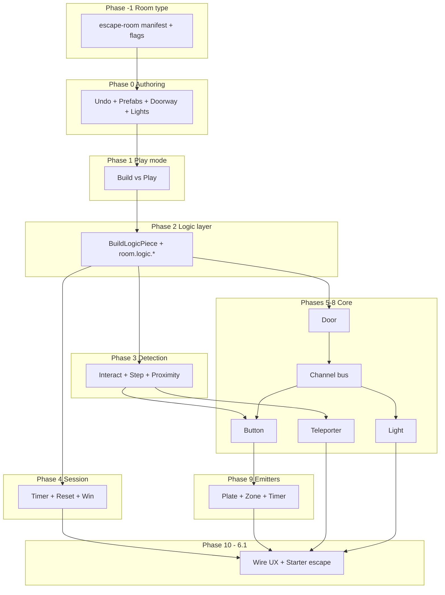

# Roadmap — Escape Room Room Type → Trigger Blocks (6.1)

Parent ideas: [`./IDEAS_FREE_FOR_ALL_WORLD_BUILDING.md`](./IDEAS_FREE_FOR_ALL_WORLD_BUILDING.md) (§5–§6)
World-building engine (reused, not FFA-specific): [`./PLAN_FREE_FOR_ALL_WORLD_BUILDING.md`](./PLAN_FREE_FOR_ALL_WORLD_BUILDING.md), [`./IMPL_FREE_FOR_ALL_WORLD_BUILDING.md`](./IMPL_FREE_FOR_ALL_WORLD_BUILDING.md)
Last updated: 2026-05-31

> **Doc location:** Lives under `world-building/` because it reuses that engine. Room type spec: [`../../escape-room/PLAN_ESCAPE_ROOM_ROOM_TYPE.md`](../../escape-room/PLAN_ESCAPE_ROOM_ROOM_TYPE.md). Logic/trigger IMPL docs follow in `escape-room/` as they land.

---

## 0. North star

**Goal:** A dedicated **`escape-room` room type** where an author builds a puzzle on an **empty canvas**, wires triggers, and players solve it — clues on boards, switches that open doors, hidden teleports, a countdown — **without writing code**.

**Not FFA:** Escape rooms are **authored experiences**, not open sandboxes. They get their own manifest, feature flags, permissions, and UX. They **reuse** the world-building engine (`BuildPiece`, `groundHeightAt`, boards-on-build-walls) but do not inherit FFA's circular hub, adjoining rooms, exit-arc no-build zones, or "anyone can destroy anything" norm.

**Capstone:** [IDEAS §6.1](./IDEAS_FREE_FOR_ALL_WORLD_BUILDING.md#61-trigger-blocks--visual-scripting-lite--xl-impact-high--plan-8-9) — **trigger blocks** wired by **channel ids**. Phase 10 of this roadmap is when that system is product-ready for escape rooms.

---

## 1. Escape Room room type

### 1.1 Why a separate room type

| Concern | FFA today | Escape room needs |
|---------|-----------|-------------------|
| Geometry | Fixed hub + 4 adjoining rooms, cylindrical perimeter | **Blank canvas** — author defines every wall |
| No-build zones | Spawns, halls, exits, static boards | **Minimal** — spawn + optional margin only |
| Destroy policy | Anyone can destroy (anti-grief escape hatch) | **Owner/author only** — puzzles must not be nuked mid-run |
| Mode | Always "sandbox" | **Build mode** vs **Play mode** |
| Session | None | **Timer, reset, win condition** |
| Feature noise | AI notes, open social hub | Focused: build, logic, boards, props, timer |

Building escape rooms inside FFA fights the manifest (hall keep-outs, radial clamp, board zones) and the social contract (equal destroy rights). A new type is cheaper than special-casing FFA.

### 1.2 The canvas — empty by default

**Recommended v1 manifest:** `createEscapeRoomManifest()` in `room-engine`.

```
┌─────────────────────────────────────────────┐
│  open sky / neutral ambient                 │
│                                             │
│     flat floor (y = 0), subtle grid         │
│     bounds clamp e.g. ±40 m (80×80 m)       │
│     NO manifest interior walls              │
│     NO tiers, halls, or pre-placed boards   │
│     1–4 spawn points (author places rest)   │
│                                             │
└─────────────────────────────────────────────┘
         ↑ invisible bounds clamp only
```

| Property | Proposed default | Rationale |
|----------|------------------|-----------|
| Footprint | **80×80 m** (±40 bounds) | Fits ~20–40 grid cells per side at 2 m cells — enough for a 4–8 room escape without FFA's 86 m complexity |
| Floor | Single flat tier at `y = 0` | All verticality comes from **build** floors/ramps |
| Manifest walls | **None** | Author builds every room wall |
| Manifest anchors | **None** | All boards go on **build walls** |
| Spawn points | 1 author spawn + 1–3 player spawns (configurable) | Authors stamp player spawns inside their start room |
| Height cap | Reuse `BUILD_MAX_LEVEL` (4 levels / 8 m) | Matches engine constant |

**Outer walls: recommendation**

| Option | Pros | Cons | Verdict |
|--------|------|------|---------|
| **A. No outer walls (recommended v1)** | True blank canvas; author owns entire perimeter; no accidental "world edge" confusion | Players can walk to invisible edge | **Ship this** — clamp XZ + optional play-mode "return to spawn" at bounds |
| **B. Low manifest perimeter (0.5 m lip)** | Visible stage edge; stops walking off visually | Authors may fight pre-placed edges when their rooms abut bounds | Optional room setting `perimeterWalls: true` |
| **C. Full-height outer box** | Hard containment | Feels like a cage; wastes build budget on edges nobody puzzles in | Defer — offer as **prefab stamp** ("perimeter box") instead |

**Do not** copy FFA's cylindrical perimeter or radial clamp — escape-room movement uses the same axis-aligned resolver but **no** `ffa-perim-*` walls.

### 1.3 Room type registration

```ts
type RoomType = "classroom" | "workforce-training" | "free-for-all" | "escape-room";
```

**Feature flags** (`ESCAPE_ROOM_ROOM_TYPE_FEATURE_FLAGS` — new block in `getRoomTypeFeatureFlags`):

| Flag | Value | Why |
|------|-------|-----|
| `building` | `true` | Structural kit |
| `dynamicBoards` | `true` | Clues on build walls |
| `logic` | `true` (**new flag**) | Trigger blocks |
| `worldSkins` | `true` | Dark / moody rooms |
| `aiObjects` | `true` (optional) | Props, statues, keys |
| `roomObjects` | `true` | Physical clue props |
| `openJoin` | `false` (default) | Authored experiences often invite-only; flip per room |
| `liveCaptions` | `false` | Optional later |
| `aiMeetingNotes` | `false` | Not the use case |
| All `classroom*` | `false` | |

**Default room settings** (escape-room-specific):

| Setting | Default | Why |
|---------|---------|-----|
| `buildDestroyPolicy` | `"owner-or-teacher"` | Only author edits layout |
| `buildingEnabled` | `true` in build mode | |
| `playModeEnabled` | `false` until author publishes | |
| `logicEnabled` | `true` | |
| No-build mask | Spawn keep-out only | No FFA hall/exit/board zones |

**Roles (UX copy):**

- **Author / Owner** — creates room, builds, wires logic, starts/resets session.
- **Player** — joins in play mode; can interact (buttons, plates) but not build or destroy.

Implementation can keep internal `teacher` for owner (reuse guards) but surface "Author" / "Player" in UI.

### 1.4 What we reuse from world-building (already shipped)

Same engine, different manifest and flags:

- `BuildPiece` (wall / floor / ramp), persistence, `room.build.*`
- `boardPlacementWalls`, dynamic boards on build walls
- `groundHeightAt`, height-aware collision
- Build grid (2 m), caps (maybe **raise** per-room cap for large layouts)

### 1.5 Implementation: room type (Phase −1)

**Plan:** [`../../escape-room/PLAN_ESCAPE_ROOM_ROOM_TYPE.md`](../../escape-room/PLAN_ESCAPE_ROOM_ROOM_TYPE.md)

| Step | Deliverable |
|------|-------------|
| **−1.1** | `createEscapeRoomManifest()` + unit tests |
| **−1.2** | `RoomType "escape-room"` in contracts, lobby selector, room creation route |
| **−1.3** | `ESCAPE_ROOM_ROOM_TYPE_FEATURE_FLAGS` + `logic` flag on `RoomTypeFeatureFlags` |
| **−1.4** | Escape-specific `isBuildAllowedAt` mask (spawn keep-out only; no FFA mask) |
| **−1.5** | Lobby copy: "Escape Room — build and play puzzle rooms" |

---

## 2. How the puzzle system works

Escape rooms are **layout + wiring + session**. Three layers:

```
┌─────────────────────────────────────────────────────────────┐
│  SESSION LAYER                                              │
│  timer, start/reset, win zone, spawn lock                   │
└───────────────────────────┬─────────────────────────────────┘
                            │
┌───────────────────────────▼─────────────────────────────────┐
│  LOGIC LAYER (BuildLogicPiece + runtime state)              │
│  emitters ──pulse──▶ CHANNEL BUS ◀──listen── consumers     │
└───────────────────────────┬─────────────────────────────────┘
                            │
┌───────────────────────────▼─────────────────────────────────┐
│  STRUCTURE LAYER (BuildPiece — static)                      │
│  walls, floors, ramps, doorways + boards + props            │
└─────────────────────────────────────────────────────────────┘
```

### 2.1 Channels — the wire

A **channel** is a named string (`"vault-door"`, `"basement-lights"`, `"puzzle-a-done"`). It is not a physical object — it is the **bus** that connects emitters to consumers.

| Event | Meaning |
|-------|---------|
| **Pulse** | Momentary signal (button press, step on plate). Consumers configured as `momentary` react on rising edge. |
| **Latch ON / OFF** | Sustained state (toggle button, plate held). Consumers can require `latched` to stay open. |
| **Set / Clear** | Authoritative bool (for sequence puzzles — see §4.4). |

**One channel → many listeners.** A single pulse on `"main-door"` can simultaneously:

- Open a **door** consumer
- Turn on a **light** consumer in the next room (reveals a **board** clue)
- Arm a **teleporter** pad

That is how **one solution unlocks the next clue** without a node graph: the door opening and the light turning on share a channel.

### 2.2 Emitters vs consumers

| Role | Job | Examples |
|------|-----|----------|
| **Emitter** | Detects player action or time → **writes** to a channel | Button, pressure plate, proximity zone, timer |
| **Consumer** | **Reads** channel → changes world state | Door, light, teleporter arm/disarm |

Every logic node has:

- `kind` — behavior template
- `channelId` — which bus (emitters: output; consumers: input)
- `config` — mode-specific (`momentary` / `toggle`, `linkId`, debounce ms, …)
- **Runtime state** — `{ open, latched, armed, … }` synced server-side

### 2.3 Detection → emitter pipeline

```
Avatar position / input
        │
        ▼
┌───────────────────┐
│ Detection (Phase 3)│  interact (E/click), step-on cell, proximity volume
└─────────┬─────────┘
          ▼
┌───────────────────┐
│ Emitter logic node │  applies debounce, toggle rules
└─────────┬─────────┘
          ▼
   pulseChannel("vault-door")
          │
          ▼
┌───────────────────┐
│ Server channel bus │  authoritative; broadcasts state patch
└─────────┬─────────┘
          ▼
┌───────────────────┐
│ Consumer listeners │  door.open = true, light.on = true, …
└───────────────────┘
```

**Why server-authoritative:** A door must not open client-side only — two players in co-op escape must see the same door. Server validates emitter events (was the avatar actually on the plate?) then patches consumer state → `room.logic.state.v1` realtime.

### 2.4 Build mode vs Play mode

| | Build mode | Play mode |
|---|-----------|-----------|
| Structural pieces | Place / destroy (author only) | Frozen |
| Logic nodes | Place / wire channels | Active — emitters fire, consumers react |
| Boards | Edit content | Read-only for players |
| Session | — | Timer runs; reset clears logic state |

Authors **test** by switching to play mode without leaving the room. Players **never** see the build bar.

### 2.5 Clue delivery — how players learn what to do

Clues are not a separate system — they emerge from **combining** static content with logic:

| Clue vehicle | How player receives it | Typical pairing |
|--------------|------------------------|-----------------|
| **Board on wall** | Text, image, video, timer widget | Visible from spawn; second board behind locked **door** |
| **Light turns on** | Room was dark; solving puzzle illuminates a wall with a **board** | `button → channel → light` |
| **Door opens** | New area becomes reachable — **environmental clue** | `plate → channel → door` reveals study with props |
| **Prop / room object** | 3D object in newly accessible space | Behind first **door**; inspect in world |
| **Teleporter** | Sudden context change — "where am I now?" | Hidden **pad** armed after **proximity** near statue |
| **Timer HUD** | Urgency | Session layer — independent of channels |
| **Sound / emissive pulse** | Button feedback confirms "that did something" | Emitter visual feedback (Phase 6) |

**Design pattern:** *Gate clue behind channel.* Don't show everything at start — use **closed doors**, **off lights**, and **disarmed teleporters** to sequence discovery.

---

## 3. Element catalog

Each entry: **what it is**, **why escape rooms want it**, **what it pairs with**.

### 3.1 Structural pieces (BuildPiece — static)

#### Wall
- **What:** Impassable 2×2 m vertical slab on a grid edge.
- **Why:** Defines rooms, hides clues, creates "locked in" feeling.
- **Pairs with:** **Door** consumer on same edge (wall becomes passable when open). **Board** on face for clues. **Light** inside enclosed room (dark until solved).

#### Floor / ramp
- **What:** Walkable surfaces; ramps connect height levels.
- **Why:** Multi-level escapes ( balcony clue, ramp down to basement ).
- **Pairs with:** **Teleporter** at top of ramp for disorienting exits. **Pressure plate** on landing. **Spawn** on upper floor for split-start puzzles (advanced).

#### Doorway wall (Phase 0.3)
- **What:** Wall with passable gap at avatar height — looks like a framed opening.
- **Why:** Connects rooms **before** logic doors exist; or permanent passages.
- **Pairs with:** **Door** logic on a *different* wall to gate the real exit while doorway leads to a red herring room.

#### Glass wall (optional)
- **What:** Transparent impassable wall.
- **Why:** "See the clue/tool but can't reach it yet" — classic escape tension.
- **Pairs with:** **Door** or **teleporter** on far side after solving visible **button** through glass.

#### Prefab / stamp (Phase 0.2)
- **What:** Saved cluster of pieces (single room shell, corridor, 2×2 cell).
- **Why:** Authors build 10 rooms faster; fewer errors.
- **Pairs with:** Everything — stamps are layout shortcuts, not logic.

#### Placeable light — static (Phase 0.4)
- **What:** Visual + point light, always on during build.
- **Why:** Author sets mood while building.
- **Pairs with:** Upgraded to **light consumer** (Phase 8) for puzzle-controlled reveal.

---

### 3.2 Clue & content surfaces (mostly static, not logic)

#### Board on build wall (shipped)
- **What:** Dynamic wall anchor on a **build wall** — image, text, video, note, timer, etc.
- **Why:** Primary **explicit clue** surface — codes, narrative, instructions.
- **Pairs with:**
  - **Locked door** in same room → read board → find button elsewhere.
  - **Light consumer** → dark room until plate pressed → board becomes readable.
  - **Second board** in room revealed by **door** → chained narrative.

#### Room object / prop (optional track)
- **What:** Free-pose 3D object (crate, statue, key model).
- **Why:** Environmental storytelling; "search the room" fantasy.
- **Pairs with:** **Proximity zone** hidden inside prop collision area → pulses channel when player walks to statue.

---

### 3.3 Logic consumers (BuildLogicPiece — stateful)

#### Door
- **What:** Occupies a wall edge. States: `open` | `closed`. Closed = wall collider; open = passable.
- **Why:** The core **gate** — 90% of escape puzzles are "get door open."
- **Pairs with:**
  - **Button** → `channel "cell-door"` → door listens → opens.
  - **Pressure plate** → must stand on plate to keep door open (momentary) or latch open (toggle).
  - **Timer emitter** → door opens 30s after first button (delayed reward).
  - **Board** in room beyond door → **clue chain**.

#### Light (toggle consumer)
- **What:** Same render as static light; state `on` | `off`.
- **Why:** **Reveal clues** — board on wall invisible/unreadable in dark until light on.
- **Pairs with:**
  - **Button** in adjacent room → light in target room (cross-room wiring via shared channel).
  - **Proximity zone** → lights follow player down corridor (atmosphere + hint path).
  - **Door** + light on same channel → enter AND see at once.

#### Teleporter pad
- **What:** Floor cell; `linkId` pairs two pads. Optional `armed: false` until channel pulses.
- **Why:** Secret passages, one-way escapes, "wrong room" misdirection, final exit warp.
- **Pairs with:**
  - **Disarmed until channel** → hidden pad behind **door** → press **button** → pad activates.
  - **One-way pair** → pad A→B but B has no return (author deletes reverse).
  - **Board** at destination explains next puzzle.

---

### 3.4 Logic emitters (BuildLogicPiece — event sources)

#### Button
- **What:** Interact (`E` / click) pulses or toggles channel.
- **Why:** Deliberate player action — "pull the lever."
- **Pairs with:** **Door**, **light**, **teleporter arm** on same or different channel. Multiple buttons on **different** channels for multi-step (see §4.4).

#### Pressure plate
- **What:** Step-on cell pulses/toggles channel; optional step-off pulse.
- **Why:** "Stand here" / weight puzzles / hold-door-open while partner passes.
- **Pairs with:**
  - **Door** with `momentary` → door only open while standing (co-op: one holds, one passes).
  - **Two plates, same channel, consumer AND mode** (Phase 9+) → both must be held.
  - **Plate** under **prop** footprint (hidden plate).

#### Proximity zone
- **What:** Volume (1+ cells); enter/exit/sustain pulses channel.
- **Why:** "Search the room" without clicking — walk near statue, secret triggers.
- **Pairs with:**
  - **Light** → corridor lights up as you approach exit (guiding).
  - **Teleporter arm** → only activates when player finds corner.
  - **Timer start** → entering zone starts countdown sub-puzzle.

#### Timer emitter
- **What:** After delay or on interval, pulses channel.
- **Why:** Delayed unlocks, "race the room," bomb defusal tension.
- **Pairs with:**
  - **Button** pulses `"start-delay"` → timer listens → 30s later pulses `"vault-open"` → **door**.
  - Session **HUD timer** (separate) for overall escape limit.

---

### 3.5 Session elements (room-level, not grid pieces)

#### Escape session + HUD timer
- **What:** Author starts run; countdown visible to all players.
- **Why:** Defines "escape" vs endless wandering.
- **Pairs with:** **Win zone** (exit plate stops timer). **Reset** rewinds all logic state for next group.

#### Spawn point
- **What:** Manifest spawn (author places via stamp or marks in build).
- **Why:** Players start **inside** first locked room.
- **Pairs with:** **Door** closed on spawn room's exit. **Board** facing spawn with intro clue.

#### Win / exit zone
- **What:** Logic floor cell flagged `isExit`; step-on ends session successfully.
- **Why:** Clear "you escaped" moment.
- **Pairs with:** **Teleporter** to exit cell, or **door** chain leading to final **plate**.

---

## 4. Puzzle recipes — combining elements

Concrete patterns authors assemble. Channel names shown in quotes.

### 4.1 Tutorial — one switch, one door

```
[Spawn room]
  Board: "Find the red button"
  Door (closed) on north edge ──listens──▶ "main-door"
  Button (red, east wall) ──pulses──▶ "main-door"
```

**Flow:** Player reads board → finds button → presses → door opens → walk through.

**Why it works:** Smallest loop teaches interact + channel + door without extra systems.

---

### 4.2 Clue reveal — dark room + light

```
[Dark room]  Light (off) ──listens──▶ "study-light"
             Board on wall (unreadable in dark — author uses dim text/image)
[Adjacent closet]
             Button ──pulses──▶ "study-light"
```

**Flow:** Player enters dark room, can't read clue → explores → finds button in closet → light on → board readable → code for next puzzle.

**Why it works:** **Light + board** sequencing without new tech — same channel drives both if co-located, or separate rooms via shared channel.

---

### 4.3 Hold the door — co-op pressure plate

```
[Corridor]   Door (momentary listen) ──listens──▶ "hold-door"
             Plate A ──pulses while stood──▶ "hold-door"
```

**Flow:** Door opens only while someone stands on plate; partner walks through.

**Co-op variant:** Plate A and Plate B both required (AND) — see §4.6.

---

### 4.4 Sequence — buttons 1 → 2 → 3

v1 pattern without a dedicated "counter" node:

```
Button-1 ──pulses──▶ "seq"  (consumer: nothing yet — use latch)
Door listens on channel "seq-complete" only

Author config (Phase 9.4 or small state machine on room):
  seq state: 0 → press btn1 → 1 → press btn2 → 2 → press btn3 → pulse "seq-complete"
```

**Flow:** Wrong order resets sequence (author setting). Right order opens final door.

**Why escape rooms want it:** "Press buttons in order shown on board" — classic.

**Implementation note:** May need a **`sequenceGate`** logic kind (Phase 9+) or a room-level `LogicState` counter. Document early; can fake with multiple channels (`step-1`, `step-2`, …) in v1.

---

### 4.5 Delayed unlock — timer after button

```
Button ──pulses──▶ "start-vault-timer"
Timer emitter (30s delay) ──listens "start-vault-timer" ──pulses──▶ "vault-open"
Door (vault) ──listens──▶ "vault-open"
Board: "Wait for the mechanism..."
```

**Flow:** Press button → wait 30s → vault door opens. Builds tension.

---

### 4.6 Two-key AND — two plates, one door

```
Plate A ──pulses──▶ "key-a"
Plate B ──pulses──▶ "key-b"
Door ──listens AND ["key-a", "key-b"]  (consumer config: requireAllLatched)
```

**Flow:** Both players (or one player routing) must hold both plates.

**v1 fallback:** Two plates same channel + door `requireSustainedPulse: true` only if **both** cells occupied (server checks multi-cell occupancy). Needs explicit Phase 9 design.

---

### 4.7 Secret passage — hidden teleporter

```
[Library]    Proximity (behind bookshelf) ──pulses──▶ "arm-secret"
[Hidden pad] Teleporter (disarmed) ──listens──▶ "arm-secret"
             Teleporter linkId: "secret-1" ↔ pad in [Vault room]
[Vault]      Board with next clue
```

**Flow:** Player searches → proximity fires → pad glows → step on pad → warp to vault.

**Why teleporter + proximity:** No visible door — discovery feels earned.

---

### 4.8 Clue chain across three rooms

```
Room 1: Board "The code is the year he arrived" + Door₁ closed
        Button ──▶ "door-1"

Room 2: (behind Door₁) Prop + Board "He arrived in 1847" + Door₂ closed
        Plate ──▶ "door-2"

Room 3: (behind Door₂) Keypad pattern: buttons 1-8-4-7 ──▶ "exit"
        Exit zone + session win
```

**Flow:** Linear narrative gating — each room's clue solves next room. Pure composition of door + board + button/plate.

---

### 4.9 Glass wall tease

```
[Hall]       Glass wall ──see──▶ [Chamber with visible Button]
             Door to chamber ──listens──▶ "chamber-door" ◀── Plate in hall
```

**Flow:** See solution through glass before you can reach it — motivates finding plate.

---

### 4.10 Full mini escape (starter kit target — Phase 10)

```
Start session (15 min HUD)
Spawn in Room A (locked)
  Board: intro
  Plate → opens Door A
Room B (dark)
  Button → Light → Board with code hint
Room C
  Button sequence → Timer 10s → Door C
Room D
  Teleporter (armed by proximity) → Exit pad → Win zone
```

**Demonstrates:** session, door, plate, button, light+board, timer, teleporter, win — the Phase 10 E2E target.

---

## 5. Architectural spine

(Unchanged intent; escape-room room type replaces FFA assumptions.)

1. **`BuildPiece`** — static structure only.
2. **`BuildLogicPiece`** — emitters + consumers; runtime state on server.
3. **`room.logic.*`** realtime — state patches, reliable.
4. **Channel bus** — server `pulseChannel` / latch; many listeners per channel.
5. **Play mode** — default for players; build mode for authors.
6. **Escape manifest** — empty canvas; no FFA no-build mask.

---

## 6. Channel & logic reference (implementation detail)

| Concept | Storage | Sync |
|---------|---------|------|
| Logic node placement | Mongo `LogicPiece` doc | `room.logic.upsert.v1` |
| Runtime state `{ doorOpen, lightOn, … }` | Room `LogicState` doc or embedded | `room.logic.state.v1` |
| Channel bool / lastPulse | Server memory + persist optional | Included in state patch |
| Session `{ startedAt, status }` | Room `EscapeSession` | `room.session.v1` (new) |

**Consumer listen modes (config):**

| Mode | Behavior |
|------|----------|
| `momentary` | Open on pulse; optionally auto-close after delay |
| `toggle` | Each pulse flips open/closed |
| `latch` | Pulse opens; stays open until reset/session end |
| `requireAll` (AND) | Needs multiple channel latches (Phase 9+) |

**Emitter fire modes (config):**

| Mode | Behavior |
|------|----------|
| `pulse` | Fire once per action |
| `toggle` | Each interact flips channel latched state |
| `whileHeld` | Plate: true while avatar on cell |

---

## 7. Optional parallel tracks

| Track | Escape room use | When |
|-------|-----------------|------|
| Versioned saves / templates | Ship room to another class | After Phase 0.2 |
| Props / collectibles | Physical keys | Phase 9+ |
| Glass walls | Tease clues | Phase 0 |
| Multi-select edit | Faster authoring | Phase 0 |
| AI layout → stamp | Bootstrap layout | Post-6.1 |
| Shared browser on board | Live web clue | If `sharedBrowsers` enabled for type |

---

## 8. Implementation order

Phases are **sequential**. Phase **−1** is new (room type).

### Phase −1 — Escape Room room type
See §1.5. **Exit:** Create escape-room from lobby; empty flat canvas; building works; no FFA geometry.

### Phase 0 — Authoring baseline
| Step | Deliverable |
|------|-------------|
| 0.1 | Undo / redo |
| 0.2 | Prefabs / stamps (room shell, corridor, spawn marker) |
| 0.3 | Doorway wall |
| 0.4 | Static placeable lights |
| 0.5 | Build onboarding + rejection tooltips |

**Exit:** Author stamps 3-room layout on escape canvas in <10 min.

### Phase 1 — Play mode
| Step | Deliverable |
|------|-------------|
| 1.1 | `playModeEnabled` — players can't build/destroy |
| 1.2 | Author "Edit layout" toggle |
| 1.3 | `buildDestroyPolicy: owner-or-teacher` enforced |
| 1.4 | Return-to-spawn at bounds (open canvas edge case) |

### Phase 2 — Logic layer
`BuildLogicPiece`, REST, `room.logic.*`, server `LogicState`, logic authoring sub-mode.

### Phase 3 — Interaction detection
`useAvatarCell`, interact raycast, step-on, proximity.

### Phase 4 — Play session
`EscapeSession`, start/reset, timer HUD, win zone.

### Phase 5 — Door consumer
First consumer; collision + mesh + channel listen.

### Phase 6 — Channel bus + button emitter
**Minimal puzzle loop** — button → door.

### Phase 7 — Teleporter pads
Pairs + channel-gated arm.

### Phase 8 — Light consumer
Clue reveal pattern enabled.

### Phase 9 — Remaining emitters
Pressure plate, proximity zone, timer emitter, latch/toggle/AND config.

### Phase 10 — Trigger blocks 6.1 (product)
Channel picker, logic inspector, logic build bar, starter mini escape (§4.10), E2E, author docs with recipe catalog (§4).

---

## 9. Dependency graph



---

## 10. Milestones

| Milestone | After | Demo |
|-----------|-------|------|
| **M0 — Empty canvas** | −1 | Create escape-room; flat 80×80; build walls |
| **M1 — Room builder** | 0 | Stamp 3-room shell with doorways |
| **M2 — Playable** | 1 | Players can't grief layout |
| **M3 — One switch, one door** | 6 | §4.1 tutorial puzzle |
| **M4 — Clue reveal** | 8 | §4.2 dark room + light + board |
| **M5 — Mini escape** | 7+4 | §4.10 timer + teleporter exit |
| **M6 — Full kit (6.1)** | 10 | §4.10 starter + wiring UI + recipes doc |

---

## 11. New entities & flags

| Item | Notes |
|------|-------|
| `RoomType "escape-room"` | Lobby + creation |
| `createEscapeRoomManifest()` | Empty canvas; see §1.2 |
| `logic: boolean` | New `RoomTypeFeatureFlags` field |
| `BuildLogicPiece` | Emitters + consumers |
| `EscapeSession` | Timer + status |
| `room.logic.*`, `room.session.*` | Realtime families |
| `playModeEnabled` | RoomSettings |
| Channel id | Wiring string shared by nodes |

---

## 12. Open questions

1. **Canvas size** — 80×80 m enough, or 100×100? Prototype one 6-room layout and measure.
2. **Outer walls** — ship open bounds (§1.2 option A); add `perimeterWalls` setting if playtests show confusion at edges.
3. **Join policy** — invite-only default vs open join for public escape rooms?
4. **Sequence / AND puzzles** — dedicated `sequenceGate` / `andGate` logic kinds vs consumer-side config? (Recommend: consumer `requireAll` first; gate node if awkward.)
5. **Keypad UI** — dedicated numeric pad vs button sequence (§4.4)? (Recommend: defer keypad; document sequence pattern in author guide.)
6. **Logic state on refresh** — persist mid-escape or force reset? (Recommend: persist while session `active`.)
7. **2D parity** — detection must use shared cell from 2D movement if `enable2DAnalog`.
8. **Co-op headcount** — AND/plate puzzles assume 2+ players; solo mode needs alternate wiring (document in recipes).

---

## 13. Effort rollup (rough)

| Phase | Focus | Effort |
|-------|--------|--------|
| **−1** | Escape room type + manifest | ~3–5 days |
| 0 | Authoring | ~1–2 weeks |
| 1 | Play mode | ~2–3 days |
| 2 | Logic layer | ~1 week |
| 3 | Detection | ~3–5 days |
| 4 | Session | ~3–5 days |
| 5–8 | Door, bus, button, teleporter, light | ~2–3 weeks |
| 9 | Full emitters + AND/sequence | ~1 week |
| 10 | 6.1 UX + starter + docs | ~1–2 weeks |

**Total:** ~10–14 weeks (one engineer).

---

## 14. Next docs to write

1. ~~**`PLAN_ESCAPE_ROOM_ROOM_TYPE.md`**~~ — done: [`../../escape-room/PLAN_ESCAPE_ROOM_ROOM_TYPE.md`](../../escape-room/PLAN_ESCAPE_ROOM_ROOM_TYPE.md)
2. **`IMPL_ESCAPE_ROOM_ROOM_TYPE.md`** — file-level touch list for Phase −1
3. **`PLAN_ESCAPE_ROOM_TRIGGER_BLOCKS.md`** + **`IMPL_*`** — contracts, channel bus, logic pieces (Phases 2–10)
4. **Author guide** — §4 recipes as player-facing "how to build your first escape"
