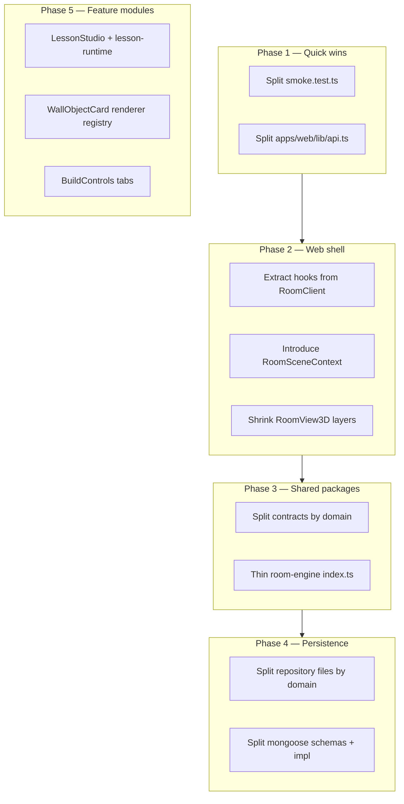

# Refactor Priority Audit

**Generated:** 2026-06-16  
**Scope:** `apps/`, `packages/`, `scripts/` (excludes `node_modules`, `.next`, `.claude/worktrees`)  
**Method:** Line-count scan of all `.ts`/`.tsx` sources, plus heuristics for separation-of-concerns risk (import fan-in, hook density, export surface, mirrored implementations, and domain mixing).

---

## Executive summary

The API monolith refactor (`apps/api/src/app.ts`) is **complete** — `app.ts` is now ~189 lines and routes live under `apps/api/src/routes/`. The largest remaining structural debts cluster in four areas:

1. **Shared contracts** — one 4,661-line Zod barrel (`packages/contracts/src/index.ts`).
2. **Room client shell** — `RoomClient.tsx` (~4,386 lines) orchestrates virtually every room feature via 38+ hooks and 36+ child components.
3. **Persistence layer** — `repository.ts` + `mongoose.ts` each implement ~100 repository methods with near-duplicate logic (~3,360 lines combined).
4. **3D view + API client** — `RoomView3D.tsx` and `apps/web/lib/api.ts` are large, multi-domain files that resist isolated changes.

This document ranks candidates by **refactor urgency** (impact × risk of continued growth), not by ease. Files under ~600 lines that are cohesive (a single procedural 3D object, a focused hook) are listed only when they show clear mixing of concerns.

---

## Methodology

| Signal | What we measured | Why it matters |
| --- | --- | --- |
| **Lines** | `wc -l` on source files | Cognitive load, review size, merge-conflict surface |
| **Import fan-in** | `import` count | Coupling; hard to test or extract |
| **Export surface** | `export` count | Barrel files become accidental dependency magnets |
| **Hook / handler density** | `useState`/`useEffect`/`useCallback` counts | React god-components and state spaghetti |
| **Mirrored code** | Paired `MemoryRepository` / `MongoRepository` methods | Every new feature costs 2× persistence edits |
| **Domain mixing** | Manual review of responsibilities | A file that owns unrelated features blocks parallel work |

**Thresholds used in tiers:**

- **Tier 1 (critical):** ≥1,500 lines *or* ≥1,000 lines with severe domain mixing / mirroring
- **Tier 2 (high):** 800–1,499 lines *or* 600–799 lines with clear multi-domain coupling
- **Tier 3 (medium):** 500–799 lines with moderate mixing, or large tests that should be split

---

## Already addressed (do not re-prioritize)

| Artifact | Before | After | Doc |
| --- | ---: | ---: | --- |
| `apps/api/src/app.ts` | ~5,300 | ~189 | [`PLAN_API_APP_DECOMPOSITION.md`](./PLAN_API_APP_DECOMPOSITION.md) |
| `apps/api/tests/api.test.ts` | ~5,760 | deleted (split) | [`IMPL_API_APP_DECOMPOSITION.md`](./IMPL_API_APP_DECOMPOSITION.md) |

---

## Tier 1 — Critical

### 1. `apps/web/components/RoomClient.tsx` — **4,386 lines**

| Metric | Value |
| --- | ---: |
| Imports | 105 |
| Custom hooks (`use*`) | 38+ |
| Child components | 36+ |
| React hook calls (`useState`/`useEffect`/…) | ~104 |

**Concerns mixed in one component:**

- Session lifecycle (join, heartbeat, leave, identity)
- Realtime message dispatch (avatars, classroom, build, world assets, translation, …)
- Avatar movement, sitting/standing, camera, spatial audio
- Wall objects, whiteboards, shared browsers, room objects
- World Builder (build mode, logic mode, asset placement, image floor)
- Classroom UI (lesson studio, groups, focus, meeting notes, captions, translation)
- Escape session, AI world host, AI object generator
- HUD layout, keyboard routing, verse theming

**Why this is #1:** Every new room feature touches this file. It is the main bottleneck for web parallelization and the hardest file to reason about during incidents.

**Suggested decomposition (phased, behavior-preserving):**

| Extract | Target | Notes |
| --- | --- | --- |
| `useRoomSession` | `apps/web/lib/room/` | Join/leave/heartbeat, session state |
| `useRoomRealtime` | `apps/web/lib/room/` | Single realtime client + typed handler registry |
| `RoomHudShell` | `apps/web/components/room/` | Panels, docks, keyboard guards — props from hooks |
| `RoomInteractionRouter` | `apps/web/lib/room/` | E-key / pointer routing (sit, podium, grab, build) |
| `RoomClient.tsx` | thin composer | Wires hooks, passes context to `RoomView3D` / `RoomView2D` |

**Companion:** [`RoomView3D.tsx`](#3-appswebcomponentsroomview3dtsx--2874-lines) should shrink as props/context consolidate.

---

### 2. `packages/contracts/src/index.ts` — **4,661 lines**

| Metric | Value |
| --- | ---: |
| `export` statements | ~715 |
| Estimated Zod schemas | ~400+ |
| Domain clusters (heuristic) | classroom (~81), room-manifest (~69), wall-objects (~19), build (~17), AI (~12), … |

**Problem:** Single barrel for every API schema, realtime message, OpenAPI type, and shared constant. Any import from `@3dspace/contracts` can pull unrelated symbols; tree-shaking helps runtime but not editor/typecheck ergonomics.

**Note:** Explicitly **out of scope** for the API decomposition plan — still the top shared-package refactor.

**Suggested split (by domain, re-export from `index.ts` during migration):**

```
packages/contracts/src/
  index.ts              # re-exports only (shrink over time)
  core/                 # Role, Vector*, common enums
  room/                 # RoomManifest, settings, capabilities
  wall-objects/
  whiteboards/
  classroom/            # LessonRun, ClassroomState, actions
  build/
  world-assets/
  room-objects/
  ai-host/
  ai-objects/
  shared-browser/
  meeting-notes/
  translation/
  auth/
  realtime/             # message schemas
  open-api.ts           # generated or assembled registry
```

**Risk:** Wide import churn across `apps/api`, `apps/web`, `packages/room-engine`. Use re-exports and migrate consumers incrementally.

---

### 3. `apps/api/src/repository.ts` + `apps/api/src/models/mongoose.ts` — **1,787 + 2,575 lines**

| Metric | `repository.ts` | `mongoose.ts` |
| --- | ---: | ---: |
| `Repository` methods | ~100 (`MemoryRepository`) | ~100 (`MongoRepository`) |
| Structure | Interface + in-memory maps | `createModels` (~850 lines) + Mongo impl (~1,595 lines) |

**Problem:** Dual implementation of the same ~100-method interface. New persistence features require parallel edits, and subtle behavioral drift is likely (optimistic locking, soft-delete, index quirks).

**Suggested approach:**

1. **Short term:** Split by domain into files behind the same `Repository` type:
   - `repository/users.ts`, `repository/rooms.ts`, `repository/wall-objects.ts`, `repository/build.ts`, …
   - `mongoose/schemas/*.ts` + `mongoose/repository/*.ts`
2. **Medium term:** Shared query helpers or code-generated method stubs to reduce duplication.
3. **Long term:** Consider repository-per-aggregate with narrower interfaces (classroom repo, build repo) injected into route `ctx`.

---

### 4. `apps/api/tests/routes/smoke.test.ts` — **3,353 lines / 62 tests**

**Problem:** Successor to the deleted `api.test.ts` monolith. Still bundles cross-domain smoke coverage (classes, rooms, invites, sessions, OpenAPI parity) in one file.

**Suggested split:**

- `smoke/openapi.test.ts` — `/openapi.json` regression
- `smoke/auth-session.test.ts` — class/room/invite/session happy paths
- `smoke/verse-settings.test.ts` — verse-specific settings healing
- Keep `describe` blocks that mirror route plugin boundaries

**Effort:** Low; high value for CI signal isolation (matches Phase 0 of API decomposition).

---

## Tier 2 — High

### 5. `apps/web/components/RoomView3D.tsx` — **2,874 lines**

| Metric | Value |
| --- | ---: |
| React hook calls | ~70 |
| Concerns | R3F canvas, avatars, build layers, wall objects, logic, assets, lighting, classroom overlays |

**Problem:** Second god-component. Receives a very wide prop surface from `RoomClient` and embeds placement controllers, layers, and HTML overlays.

**Suggested splits:**

| Module | Responsibility |
| --- | --- |
| `RoomScene.tsx` | Canvas, lighting, skin context |
| `RoomAvatarsLayer.tsx` | Participant avatars + AI host |
| `RoomBuildStack.tsx` | BuildPlacementController, BuildLayer, logic layers |
| `RoomWallSurfaces.tsx` | WallObjectCard instances, shared browser surfaces |
| Context providers | `RoomSceneContext` to replace prop drilling |

---

### 6. `packages/room-engine/src/index.ts` — **1,865 lines / ~99 exports**

**Problem:** Despite 15 sibling modules (`build.ts`, `logic.ts`, `classroom.ts`, …), `index.ts` still contains manifest factories, room-type constants, board placement math, and re-exports. Becomes a second contracts-like barrel.

**Suggested approach:**

- Move manifest factories to `manifests/classroom.ts`, `manifests/verse.ts`, `manifests/workforce-training.ts`, `manifests/ffa.ts`
- Move board/anchor constants to `layout/board-constants.ts`
- Keep `index.ts` as explicit re-exports only (~100 lines)

**Note:** `packages/room-engine/src/build.ts` (647 lines) is large but more cohesive — lower priority than `index.ts`.

---

### 7. `apps/web/lib/api.ts` — **1,515 lines / ~100 exported functions**

**Problem:** Monolithic HTTP client for every REST endpoint (auth, rooms, wall objects, build, AI host, translation, meeting notes, …).

**Suggested split:**

```
apps/web/lib/api/
  index.ts           # re-export surface (stable import path)
  client.ts          # apiFetch, auth headers, errors
  classes.ts
  rooms.ts
  wall-objects.ts
  build-pieces.ts
  world-assets.ts
  classroom.ts
  ai-host.ts
  translation.ts
  meeting-notes.ts
```

**Effort:** Mechanical; improves merge parallelism with low behavioral risk.

---

### 8. `apps/web/components/LessonStudio.tsx` — **1,661 lines**

**Problem:** Full-screen lesson builder combining step palette, script outline, per-step editors (8 step kinds), slide-deck filmstrip, image upload, and room-context rail.

**Suggested splits:**

| Component | Lines (approx.) |
| --- | --- |
| `LessonStudioShell.tsx` | layout, open/close, keyboard trap |
| `LessonStepPalette.tsx` | add-step chips |
| `LessonScriptOutline.tsx` | ordered steps list |
| `LessonStepEditor.tsx` | dispatches by `LessonStepKind` |
| `LessonSlideDeckEditor.tsx` | slide-deck-specific UI (largest step editor) |
| `LessonStudioContextRail.tsx` | boards, people, flight check |

---

### 9. `apps/api/src/classroom/lesson-runtime.ts` — **1,127 lines**

**Problem:** Lesson state machine helpers + async step lifecycle (`startLessonStep` ~500 lines) + recap/CSV in one module.

**Suggested splits:**

- `lesson-runtime/helpers.ts` — pure find/validate functions
- `lesson-runtime/step-lifecycle.ts` — `startLessonStep`, `completeCurrentLessonStep`, timers
- `lesson-runtime/recap.ts` — `buildLessonRecap`, `renderRecapCsv`, `filterLessonRunForActor`

**Related:** `apps/api/src/classroom/run-classroom-action.ts` (700 lines) — consider `actions/` folder with one file per action group once lesson-runtime is smaller.

---

### 10. `apps/web/lib/realtime.ts` — **811 lines**

**Problem:** WebSocket client, message parsing, subscription routing, and reconnection logic in one file. Grows with every realtime channel.

**Suggested split:** `realtime/client.ts`, `realtime/messages.ts` (schema dispatch), `realtime/reconnect.ts`.

---

## Tier 3 — Medium

Files worth refactoring when touching adjacent features, or as dedicated cleanup PRs.

| File | Lines | Issue | Suggested action |
| --- | ---: | --- | --- |
| `apps/web/components/LegacyLobby.tsx` | 1,086 | Legacy `/legacy` route only; duplicates `Lobby.tsx` patterns | Delete when legacy route retired, or extract shared `LobbyShell` |
| `apps/web/components/BuildControls.tsx` | 1,022 | World Builder dock (Build/Objects/Scenes tabs, image floor, tools) | Split per tab: `BuildControlsBuildTab`, `BuildControlsObjectsTab`, … |
| `apps/web/components/WallObjectCard.tsx` | 908 | Renders every wall object type (poll, slides, whiteboard, web resource, …) | Strategy pattern: `wallObjectRenderers[type].tsx` |
| `apps/web/components/BuildPlacementController.tsx` | 834 | Pointer routing, ghost, commit, stamp (removed), image-floor rect | Already improved in phases 1–5; extract `image-floor/` and `fixture/` submodules |
| `apps/web/components/Whiteboard/WhiteboardSurface.tsx` | 820 | Drawing + toolbar + sync | Split renderer vs. toolbar vs. stroke sync hook |
| `apps/api/src/routes/wall-objects.ts` | 700 | Largest route plugin; inline poll/slide/board helpers | Extract `wall-objects/create.ts`, `control.ts`, `anchors.ts` |
| `apps/api/src/classroom/run-classroom-action.ts` | 700 | Single `switch` dispatch | `actions/*.ts` per domain (lesson, pods, spotlight, …) |
| `apps/web/lib/useAvatarMovement.ts` | 768 | Movement + physics + build collision + sitting integration | Extract `movement/physics-bridge.ts` |
| `apps/web/lib/useAiWorldHost.ts` | 755 | AI host scene + chat + file study state | Split scene config vs. chat vs. file ingestion |
| `apps/web/components/BuildPieceMesh.tsx` | 739 | Every build piece kind + image-floor regions | Renderer registry per `BuildPieceKind` |
| `apps/web/lib/useWallObjects.ts` | 640 | CRUD + optimistic updates + slide/poll controls | Split API layer from React state |
| `apps/web/lib/buildPlacement.ts` | 637 | Placement evaluation + destroy + surface resolution | Cohesive but test-heavy; split `evaluate.ts` vs. `destroy.ts` |
| `apps/web/components/AnchorPanel.tsx` | 648 | Dynamic anchors + board management UI | Split list vs. editor |
| `apps/api/src/config.ts` | 497 | All env parsing | Split by domain (`config/storage.ts`, `config/ai.ts`, …) |
| `apps/api/tests/routes/build-pieces.test.ts` | 800 | Large route test file | Split by endpoint group |
| `apps/web/components/roomObjectProcedurals/earthGlobe.tsx` | 1,060 | Procedural 3D + interaction | Acceptable if isolated; split mesh vs. interaction panel |

---

## Recommended priority order

Phased roadmap balancing **risk reduction** and **developer velocity**:



| Order | Target | Rationale |
| ---: | --- | --- |
| 1 | `smoke.test.ts` | Low risk; restores test modularity from API refactor |
| 2 | `apps/web/lib/api.ts` | Mechanical; unblocks parallel web feature work |
| 3 | `RoomClient.tsx` hooks extraction | Highest ongoing tax on every feature |
| 4 | `RoomView3D.tsx` layer split | Follows RoomClient decomposition |
| 5 | `packages/contracts` domain modules | Reduces cross-package coupling before more APIs |
| 6 | `repository.ts` / `mongoose.ts` | Needed before persistence layer grows further |
| 7 | `lesson-runtime.ts`, `LessonStudio.tsx` | Classroom feature maturity; isolated domain |
| 8 | `WallObjectCard`, `BuildControls`, route plugins | Incremental when touching those features |

---

## Files intentionally deprioritized

| File | Lines | Reason |
| --- | ---: | --- |
| `apps/api/src/app.ts` | 189 | Refactor complete |
| `apps/web/components/roomObjectProcedurals/*.tsx` | 400–1,060 | Single-object procedural renderers; size is inherent |
| `packages/room-engine/tests/*.test.ts` | 500–775 | Test bulk is acceptable |
| `apps/web/test/*.spec.ts` | 380–526 | E2E specs; split only when flaky |
| `scripts/_tmp-*.mjs` | small | Debug scratch files; delete rather than refactor |

---

## Metrics snapshot (top 20 by lines)

| Rank | File | Lines | Tier |
| ---: | --- | ---: | --- |
| 1 | `packages/contracts/src/index.ts` | 4,661 | 1 |
| 2 | `apps/web/components/RoomClient.tsx` | 4,386 | 1 |
| 3 | `apps/api/tests/routes/smoke.test.ts` | 3,353 | 1 |
| 4 | `apps/web/components/RoomView3D.tsx` | 2,874 | 2 |
| 5 | `apps/api/src/models/mongoose.ts` | 2,575 | 1 |
| 6 | `packages/room-engine/src/index.ts` | 1,865 | 2 |
| 7 | `apps/api/src/repository.ts` | 1,787 | 1 |
| 8 | `apps/web/components/LessonStudio.tsx` | 1,661 | 2 |
| 9 | `apps/web/lib/api.ts` | 1,515 | 2 |
| 10 | `apps/api/src/classroom/lesson-runtime.ts` | 1,127 | 2 |
| 11 | `apps/web/components/LegacyLobby.tsx` | 1,086 | 3 |
| 12 | `apps/web/components/roomObjectProcedurals/earthGlobe.tsx` | 1,060 | 3 |
| 13 | `apps/web/components/BuildControls.tsx` | 1,022 | 3 |
| 14 | `apps/web/components/WallObjectCard.tsx` | 908 | 3 |
| 15 | `apps/web/components/BuildPlacementController.tsx` | 834 | 3 |
| 16 | `apps/web/components/Whiteboard/WhiteboardSurface.tsx` | 820 | 3 |
| 17 | `apps/web/lib/realtime.ts` | 811 | 2 |
| 18 | `apps/api/tests/routes/build-pieces.test.ts` | 800 | 3 |
| 19 | `apps/web/lib/useAvatarMovement.ts` | 768 | 3 |
| 20 | `apps/web/lib/useAiWorldHost.ts` | 755 | 3 |

---

## How to use this document

1. **Before a large feature:** Check whether the target file is Tier 1–2; prefer extracting a hook or submodule first rather than adding lines.
2. **When planning a refactor PR:** Link this audit + a focused `PLAN_*.md` / `IMPL_*.md` pair (see existing API decomposition docs).
3. **When revising priorities:** Re-run line counts and update the snapshot table; growth rate matters as much as absolute size.

---

## Related documents

| Document | Topic |
| --- | --- |
| [`PLAN_API_APP_DECOMPOSITION.md`](./PLAN_API_APP_DECOMPOSITION.md) | Completed API monolith split |
| [`IMPL_API_APP_DECOMPOSITION.md`](./IMPL_API_APP_DECOMPOSITION.md) | API refactor execution log |
| [`README.md`](./README.md) | Refactors folder index |
